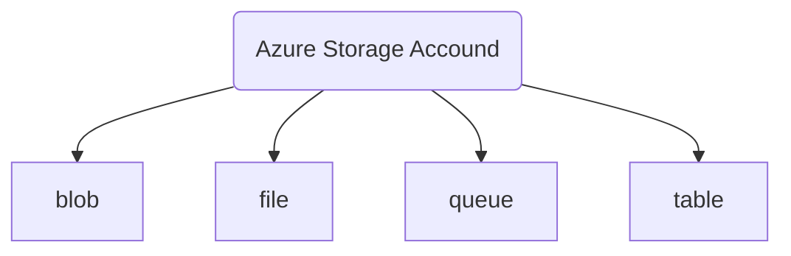

# AZ-900 prep

Course instructuor is Adam Marczak and his youtube channel is [here](https://www.youtube.com/watch?v=NPEsD6n9A_I&list=PLGjZwEtPN7j-Q59JYso3L4_yoCjj2syrM) and he also prepared the studying material and guide [here](https://marczak.io/az-900/).

This is a study guide for AZ-900 and it should cover enough matierla for me to pass AZ-900 although i am not taking it. It would be a huge add-on to explain some of the concepts i am not familiar with for the DP-203 course. Stay tuned.

**Table of contents:**

[toc]

## 1 Cloud Computing and Vocabulary

- **Scalability** : ability to scale

  - Scale in , scale out 

- **Elasticity**: is the ability to scale dynamically

  - 根据用户的峰值pattern,来动态的allocate和deallocate资源，来规避资源的浪费。(规避**杀鸡焉用牛刀**和**资源不够handle users的情况**)

- **Agility**: the abaility to allocate and deallocate (scale) resources quickly

- **Fault tolerance** is the ability to remain up and running during component and service failures.

- **Disaster** is a **serious disruption of services** caused by natural or human-induced causes.

- **Disaster recovery** is the ability to recover from an event that has taken down the service (disaster).

- **Availability** is a measure of system uptime for users/services defined as
  $$
  Availability = \frac{uptime}{uptime+downtime}
  $$

- **High availability** is the ability to keep services running for extended periods of time with very little downtime.

## 2 Economics of scale

把专业的交给专业的来做，大家都省钱省事。用的small and big delivery company的例子.

## 3 CapEx and OpEx

- capital exprenditure (CapEx)
  - Own infrastructure
  - Big initial investment
  - Lots of maintenance required
    - Support staff
    - Power & networking
    - Hardware failures
    - others
- Operational expenditure (OpEx)
  - **rent** infrastructure
  - No initial investment, pay for what you use
  - Minimal maintenance
    - Operations team

|                   | CapEx       | OpEx           |
| ----------------- | ----------- | -------------- |
| Up front cost     | significant | None           |
| ongoing cost      | Low         | Based on usage |
| tax reduction     | Overtime    | Same year      |
| early termination | No          | Anytime        |
| maintenance       | Significant | Low            |
| value over time   | Lowers      | No change      |

## 4 Consumption-based Model

Azure 收费标准: compute, storage, network, 

- **Consumption-based model**
  - Multiple pricing components per service
  - Very granular usage measurement
- 在Cost management service里可以看subscription的billing数据

## 5 Cloud Service Model (IaaS, PaaS, Saas)

试想一下，你是一个start-up and you have to set up everything while the most important thing is your business logic. 不仅up front成本高，你搭建和维护的时间也是成本 which should all go into the development of you business logics.

- **infrastructure as a service** (IaaS)
  - Cloud provider manages infrastructure
  - You manage platform & software
- **Platform as a service** (PaaS)
  - Cloud provider manages infrastructure & platform
    - Infrastructure - networking, hardware and virtualiztion
  - Yout manage software
- **Software as a Service** (SaaS)
  - Cloud provider manges everything
  - You manage nothing and you just buy it off shelf like skype, zoom etc.

## 6 Cloud deployment models

有两种地方可以deployment你的 application:

- Cloud service provider

- public cloud

  - Everything runs on cloud provider hardware

  

| Advantage                         | Cons                                       |
| --------------------------------- | ------------------------------------------ |
| No CapEx                          | Security and Compliance                    |
| High availability & Agility       | Ownership                                  |
| Pay as you go pricing             | Specifc scenarios with unique business req |
| No hardware maintenance           |                                            |
| No deep technical skills required |                                            |
|                                   |                                            |

- private cloud
  - holds verything on your own datacenter
  - self-service should be provided

| advantage                                         | Disadvantage                          |
| ------------------------------------------------- | ------------------------------------- |
| Can support any scenario                          | Initial Cap Ex                        |
| Control over security                             | Limited agility                       |
| Can meet any security and compliance requirements | IT skills and expertise are mandatory |

- hybrid cloud
  - combine both public and private cloud

| advantage                        | Disadvantage                          |
| -------------------------------- | ------------------------------------- |
| run legacy apps in private cloud | Can be more expensive                 |
| utilize existing in infracture   | Complicated to manage                 |
| Meet any security requirements   | IT skills and expertise are mandatory |

实际上听下来，用自己的data center (private cloud)为了满足安全上的需求以及一些硬件的调配，但代价比较高，需要有成熟的IT部门maintain infrastructure.

## 7 Geographise, regions and Availability Zones

Objective

- describe **data center**
- describe **regions** and **regions pairs**
- describe 
- describe
- describe benefits of 

**data center**

最小的单位是data center, 里面有millions of racks of computers. 1个或多个data centers通过高速连接(low latency network)的单位叫做regions, geographically distribtued across the earth.

**Region**

- low latency network <2miliseconds
- some services are **global services,** 
- some services are available only in **certain regions**
- Special government regions 
- Special partner regions

**Availability Zones**

- designed to protect from data center failures
- 这项服务，为以下一系列服务提供了可能 **two services categories**
  - Zonal services (VMs, disks, etc.)
    - 可以deploy VM with Availability zone
  - Zone-redundant services (SQL, storage, etc)

- Zone是x, x属于[1, N] where N is the maximum amount of data centers in a region.
- 并不是每一个region都有availability zone这个服务的

**region pair**

- Region A有且仅有一个another region B 作为配对，叫做region pair
- Region pairs are static and cannot be chosen
- Physical isolation with at least 300 miles distance
- Some services have platform-provided replication
- Planned updated across pairs

**Geographise**

- Typical contains $\geq2$ regions
- Ensures data residency, sovereighty, resiliency and compliance requirements are met
- Fault tolerant to protect from region wide failures
- Each region only belongs to one geography.

总结一下，单位从小到大分别为data center, availbility zone (optional), region, region pair, geography 

To-do

- [ ] 这一章有更多课后reference细节可以读，之后做题的时候去看一下

## 8 Resource, Resource Group, Resrouce Manager

a

**Resources**

- Objects used to manage services in Azure
- Represent service lifecycle
- Save as json definition
- 四种基本元素: Type, APIversion, name, location

**Resource groups**

- grouping of resources
-  holds logically realted resources
- By type (把所有VMs, SQLs放在一起), or by lifecycle (app, environment)

- Resource groups have their own location assigned.
- Resource group can't be nested

**Resource Manager**

- 你可以通过Azure portal, REST API, CLI etc to connect to Azure
- Centralized management layer for all resources and resources group
- Resource manager会和Azure AD check你的privileges
  - **Azure AD**: centralized identity manager

## 9 Compute Services

> Categoty of on-demand services used to run on-cloud applications

### Virtual Machine

Virtualization这个概念:

- emulation of physical machines
- Total separation of environments (to avoid conflicts)

Still too cumbersome to manage each one. So we go to another layer of abstraction.

### Virtual Machine Scale sets

### Comtainers VS VMs

- Container uses host's operating system
- **VMs emulate hardware while container emulate operating system.** 👍
- Lightweight
  - Development Effort
  - Maintenance
  - Compute & storage requirements

### Azure container instance

### Azure Kubernetes Services (AKS)

- Open-source container orchestration platform
- Designed for high scale container

### App Service

- 对于web application service, 直接创建Web App资源就可以了，对维护的需求比较少

### Azure Functions (Function Apps)

- Platform as a service
- Serverless
-  Two hosting/pricing models
- Designed for micro/nano-services

**Summary**

| Service Name                   | Description                                                  |
| ------------------------------ | ------------------------------------------------------------ |
| **Virtual Machines** (IaaS)    | Custom software, custom requirements, very specialized, high degree of control |
| **VM Scale Sets** (IaaS)       | Auto-scaled workloads for VMs                                |
| **Container Instances** (PaaS) | Simple container hosting, ez to start (lightweight compared with VM) |
| **Kubernetes Services** (PaaS) | Highly scalable and customizable container hosting platform  |
| **App Services** (PaaS)        | Web applications, lots of enterprise web hosting features, ez to start |
| **Functions** (PaaS)           | micro/nano-services, excellent consumption-based pricing, ez to start |

由于太复杂了，所以Azure做了个流程图，我现在对web application还是不太了解，所以不太清楚

总结 2022/11/24:

- 当你在同一个os，装了很多applications后, 由于共享same ports and file system, 同时运行，且运行久了，自然会有conflicts，解决这个问题的思路就是VMs
- VMs的解决问题的途径，需要装很多个小OS，每个OS里面装文件，由于需要装大量的OS，需要大量时间维护(update patches etc), 且非常笨重(一个多几个app就要用一个OS, 很吃空间)
- Container解决这个问题，Vm模拟硬件，container模拟OS, 不需要装那么多了，所以非常lightweight, 缺点是你没有那么多细节可以微调了
- 不同compute的资源，实际上是trade-off between maintainability and scalability

## 10 Azure networking services

Outline:

- Virtual Network
- Load Balancer
- VPN Gateway
- Application Gateway
- Content Delivery Network

### Virtual Network

- Emulation of physical networking infrastructure
- Designed for isolation, segmentation, communication, filtering, routing between resources (internet and on-premises)
- **VNet Peering** or **VPN Gateway** allow cross VNet Communication

略

## 11 Azure Storage Service

### Data types

- structureed vs semi-structured vs unstructured

### Blob

> Blob: binary large object desgiend for storage of files of any kind

有三种tiers:

- Hot - frequently accessed data
- Cool - infrequently accessed data (lower availability, high durability)
- Archive - rarely (if-ever) accessed data

### Queue

- queue is used for storing small pieces of data (叫做messages)
- Designed for scabable asynchronous processing

### Azure Table storage

- storage for semi-structured (NoSQL)
  - No need for foreign joins, foreign keys, relationships or strict scheme
  - Designed for fast access

### File storage

- storage for files accessed via shared drive protocols
- Designed to extend on-premise file shares or implement **lift-and-shift** scenarios
- **用fileshare, 可以在你电脑上直接mount, 额外的储存空间**

### Azure storage account

- cheapest per GB solution

### Azure Disk Storage

- **Disk emulation** in the cloud
- Disk can be unmanaged or managed

### Summary

- `Azure storage account`: Group of smaller services 
- `Disk storage`: disk emulation in the cloud

## 12 Database Services

Objective:

- Azure Cosmos DB
- Azure SQL Database

### Azure Cosmos DB

- 和table storage很像, 储存semi-structured data
- **globally distributed and schema-less** NoSQL (semi) Database services
- Multiple APIs (SQL, MongoDB, Cassandra, Gremlin, Table Storage)
- Designed for
  - Highly responsive (real time) applications with super low latency responses
  - Multi-regional application

### Azure SQL Database

- Relational database service in the cloud (PaaS)

### Azure SQL

- A family of services

  

## 13 Azure Marketplace

就像一个应用商店一样，可以买产品, software as a service etc

## 14 Azure IoT Services

Outline

- IoT Hub
- IoT Central
- Azure Sphere

> IoT: is a network of internet connected devices (IoT Devices) embedded in everyday objects enabling sending and receiving data such as settings and telemetry.

### IoT Hub

- 支持IoT 支持很多SDKs such as python, php 
- Register as many as devices as you want, 比如从raseberry pi中提取数据, 比如temperature sensor etc

### IoT Central

- IoT Hub on steroid, 有很多**industry specific app template** , 可以直接拿来背书
- built on top of IoT hub with 30+ other services

**Azure Sphere**

- Microconstroller unit (MCU) 

