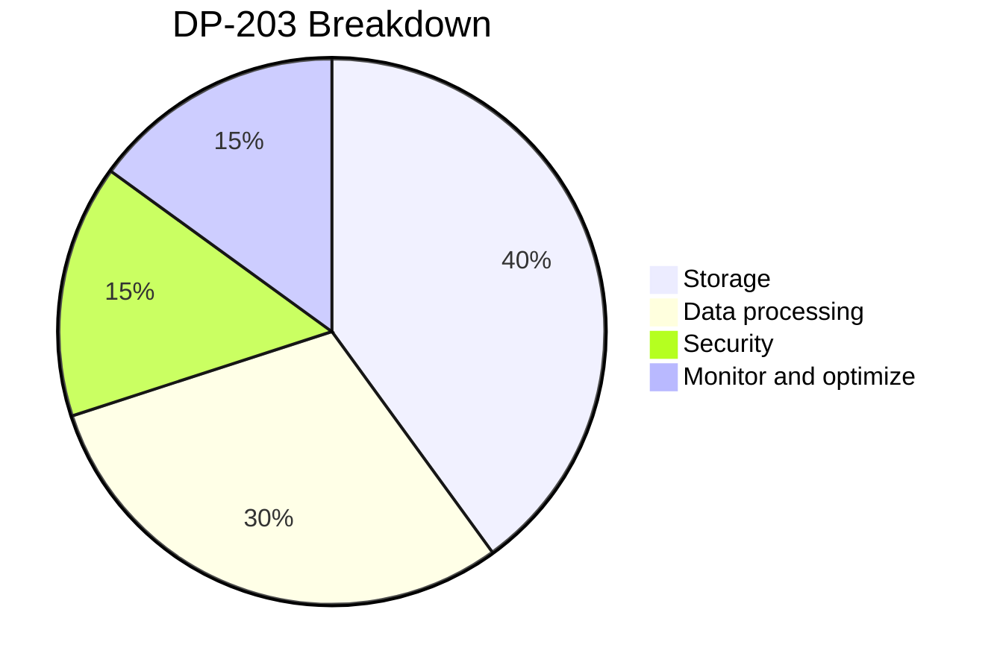

# Readme

This is a self-study guide for DP 203 Exam in Nov 2022. Passed the exam on Dec 12, 2022 (946/1000). In this repository, i would share some notes and insights for learning Azure ecosystem in general and how to pass the exam.

## Pre-req
Here, i list some pre-req before you start or something i find particular useful during the learning.
- SQL (must)
  - Azure uses T-SQL and more "SQL dialects" (subset of T-SQL) such as Stream SQL (for Azure Stream Analytics) and Synapse SQL (for Azure Synapse). Some concepts but with more capbilities such as streaming window functions etc. Some background would help you easily do the labs to learn Azure
  - Questions on DP 203 involves SQL.
- python, scala (optional)
  - Some python and scala would definitely help with the Azure databricks part. It doesn't have to be too advanced tho.
- some database knowledge (optional)
  - some idea like indexing, partitioning and viewing metadata for database would be helpful but you could learn it on the way.
- understanding of Big data eco-system (optional)
  - OLTP, OLAP, dimentional modelling in OLAP with kimball method, spark, data format (json, parquet, arvo). If those concepts are new to you, don't worry, you would clear it along the way.
- networking basics (optional)

## Exam skills measured (up to 2022.11)

- Design and implement data storage (40-45%)
- Design and develop data processing (25-30%)
- Design and implement data security (10-15%)
- Monitor and optimize data storage and data processing (10-15%)

Now we roughly transfer the percentage to a pie chart

Now, we should be focusing on the first two categories how to degisn and implement data storage and processing with services on Azure including:

- Azure Synapse Analyics
- ADLS Gen 
- Azure SQL database
- Azure Data Factory
- Azure Databricks
- Azure Stream
- etc

## Study material

Here are a list of the study material i have used for the exam.

- udemy course by Alan Rodrigues
  - Crack the exam by service, learn Azure by doing labs if you don't have any experience in Azure
  - also has practice tests (doesn't look like the actual exam pro but it's a good test to check mastery of concepts)
- [Offical microsoft learn](https://learn.microsoft.com/en-us/certifications/exams/dp-203)
  - Well contructed courses, very detailed if you need more solid understanding of the products.
- [Examtopics](https://www.examtopics.com/exams/microsoft/dp-203/)
  - Recommended. Definitely check the comment sections. There are many valuable discussion on the problem along with reference link. Definitely help me understand more about the concetps. 
  - Please read extensively of Azure documentation link they give you.
- [Youtube Wafastudies](https://www.youtube.com/watch?v=Qoatg-SPpe4&list=PLMWaZteqtEaIZxPCw_0AO1GsqESq3hZc6)
  -  If you don't have want to get the udemy course, you could substitute it with this great youtube channel.

For me, i use udemy cousre for Azure services and concepts, examtopics for practice and Azure documentation for better understanding. I used all of my free Azure credit during labs and playing around with Azure. Huge help.

## Reddit feedback

Here are some of the reddit feedback to get you a feel about the exam.

- https://www.reddit.com/r/AzureCertification/comments/nv66sl/how_to_clear_the_dp203_please_help/
  - `Surge_attack`: passed with 895, ~7 T-SQL distribution (hash vs round robin vs replicated), ~10 stream analytics, many synapse questions, few spark or databricks; Only studyed MS offical material
  - `Gimmefood1210`: failed 688 then passed 812; Eshant Garg udemy + free dumps on examtopics
- https://www.reddit.com/r/AzureCertification/comments/n6gxn0/passed_my_azure_dp203_exam_with_910_exam/
  - `DowellAmple`: back in 2020, MS Learning path + skillcertpro; focus on Azure Synapse Analytics, Data Lake storage, Azure DB 
- https://www.reddit.com/r/AzureCertification/comments/odr4aq/dp203_tips/
- https://www.reddit.com/r/dataengineering/comments/w3bse7/azure_dp203_exam/
  - `ab624`: passed 4 months ago, did a coursera course offered by MS

