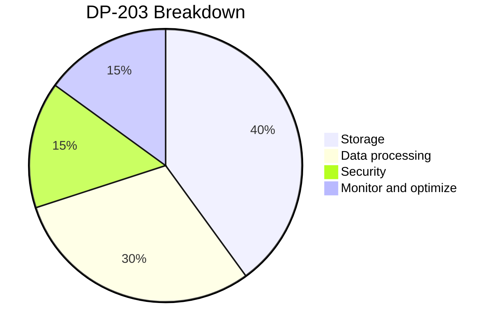

# Readme

This is a self-study guide for DP 203 Exam in Nov 2022.

## Skills measured (up to 2022.11)

- Design and implement data storage (40-45%)
- Design and develop data processing (25-30%)
- Design and implement data security (10-15%)
- Monitor and optimize data storage and data processing (10-15%)

Now we roughly transfer the percentage to a pie chart

Now, we should be focusing on the first two categories how to degisn and implement data storage and processing with services on Azure including:

- Azure Synapse Analyics
- ADLS Gen 
- Azure SQL database
- Azure Data Factory
- Azure Databricks
- Azure Stream
- etc

## Study material

Here are a list of the study material i have used for the exam.

- udemy course 
  - Crack the exam by service, after many practice labs with service, you will have a better understanding of the concepts as well
  - also has practice tests (doesn't look like the actual exam pro but it's a good test to check mastery of what he taught in class)
- Offical microsoft learn
  - Good concepts, very detailed if you need more solid understanding of the products
