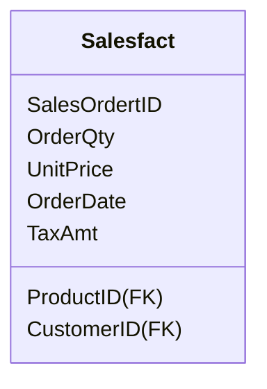
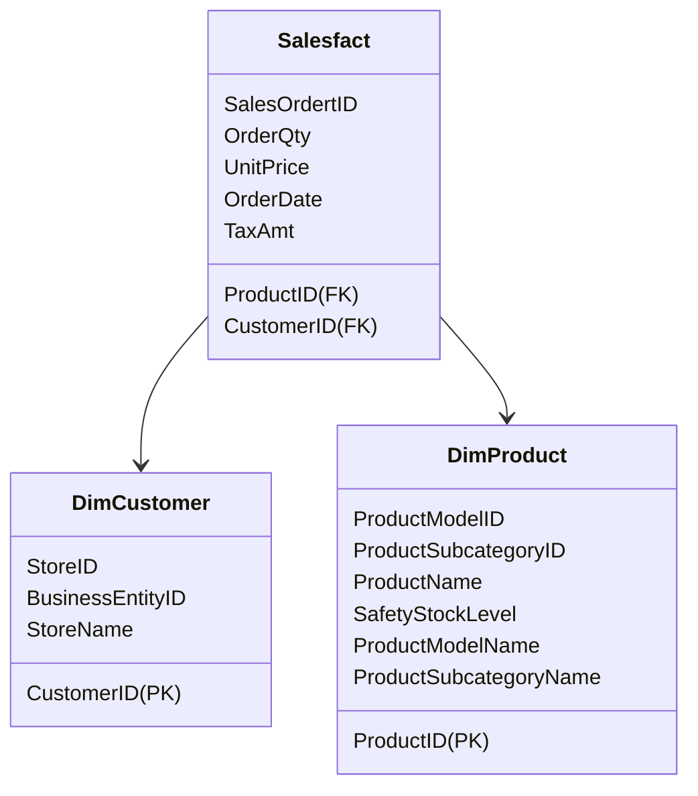
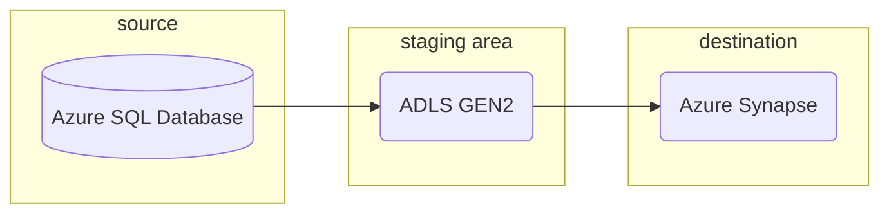

# Labs dimensional modeling

In this lab, you are going to perform dimensional modelling for an the famous `adventurework` database, which is a OLTP database published by Microsoft for learning MS SQL back in the day. Your job is to build a datawarehouse for ad


The ERD for the diagram looks like this


Please look at the zoom-in version of the diagram for more understanding to perform a better job on dimensional modeling.


By now, you should have a good theoretical understanding of 

- dimensional modeling in datawarehousing for OLAP
- what's a fact table and dimension table
- Star schema 


You will do the following sub-labs, shown in the to-do list below

- [x] Create fact table by retrieving information from two tables

- [x] Create dimension tables
- [x] Copy data into dedicated SQL pool


## Task1 Create fact table

The fact table is illustrated in the schematics below



```sql
/*
Lab: 创造一个FACT TABLE
Step 1 : first create a view
Step 2: create the Sales Fact table from the view
*/

-- Step 1: creata a view by centering two tables
CREATE VIEW [Sales_Fact_View]
AS
SELECT 
    sod.[ProductID],
    sod.[SalesOrderID],
    sod.[OrderQty],
    sod.[UnitPrice],
    soh.[OrderDate],
    soh.[CustomerID],
    soh.[TaxAmt]
FROM [Sales].[SalesOrderDetail] AS sod
LEFT JOIN [Sales].[SalesOrderHeader] AS soh
ON sod.[SalesOrderID] = soh.[SalesOrderID]

-- Step 2: Create table from view
SELECT
    a.[ProductID],
    a.SalesOrderID,
    a.OrderQty,
    a.UnitPrice,
    a.OrderDate,
    a.CustomerID,
    a.TaxAmt
Into
    SalesFact
FROM
    Sales_Fact_View AS a
```


## Task2 Create dimension table

为了create dimensional table，你实际上是需要仔细的研读你的ERD的，每个table的每个attributes, 你需要把同一类的column 都聚合到一起，也就是一个dimension table. 当然，你也可以从BI team常query的角度来解决这个问题



```sql
/*
Lab: 创造dimention tables [DimCustomer] and [DimProduct]
*/


-- 创造 [Customer_view] --> [DimCustomer]
CREATE VIEW Customer_view 
AS
SELECT 
    ct.[CustomerID],
    ct.[StoreID],
    st.[BusinessEntityID],
    st.[Name]  AS StoreName
FROM [Sales].[Customer] AS ct
LEFT JOIN [Sales].[Store] AS st 
ON ct.[StoreID]=st.[BusinessEntityID]
WHERE st.[BusinessEntityID] IS NOT NULL


SELECT 
    [CustomerID],
    [StoreID],
    [BusinessEntityID],
    [StoreName]
INTO 
    DimCustomer
FROM Customer_view 


-- 创造 [Product_view] --> [DimProduct]

CREATE VIEW Product_view 
AS
SELECT 
    prod.[ProductID],prod.[Name] AS ProductName,
    prod.[SafetyStockLevel],
    model.[ProductModelID],
    model.[Name] AS ProductModelName,
    category.[ProductSubcategoryID],
    category.[Name] AS ProductSubCategoryName
FROM [Production].[Product] prod
LEFT JOIN [Production].[ProductModel] model ON prod.[ProductModelID] = model.[ProductModelID]
LEFT JOIN [Production].[ProductSubcategory] category ON prod.[ProductSubcategoryID]=category.[ProductSubcategoryID]
WHERE prod.[ProductModelID] IS NOT NULL

-- Lets create a product dimension table

SELECT
    [ProductID],
    [ProductModelID],
    [ProductSubcategoryID],
    ProductName,
    [SafetyStockLevel],
    ProductModelName,
    ProductSubCategoryName
INTO 
    DimProduct
FROM 
    Product_view 

-- If you want to drop the views and the tables

DROP VIEW Customer_view 

DROP TABLE DimCustomer

DROP VIEW Product_view 

DROP TABLE DimProduct
```


## Task3 Load fact and dim table into Azure synapse

我们刚刚创造的这几个表格，都在Azure-server上的一个SQL database中，现在要做的事情，是把这些东西转移到你的数据仓库, 也就是转移到你Azure synapse中的dedicated SQL pool, 对于这种转移，需要一件中间的staging area作为temp储存 (为什么需要设计这样一个中转呢?) 在这个lab中的实现流程图如下



具体的操作步骤如下:

1. 在desitination 数据库中，创建empty table 注意要与source table的table名，data type以及non-null的定义
2. 在azure synapse studio中，用integrate menu中的copy data pool工具
3. 建立task名
   1. source connection建立
   2. destination connection建立
   3. linked service建立
   4. 定义loading strategy 
      1. bulk insert的copy 方式 (这个lab用)
      2. Polybase strategy (数据量很大时，用这个方式插入更快)
4. Done, now you have a pipeline

在azure synpase中定义table的代码如下

```sql
-- Lab - Transfer data to our SQL Pool

-- First let's ensure we have the tables defined in the SQL pool

CREATE TABLE [dbo].[SalesFact](
	[ProductID] [int] NOT NULL,
	[SalesOrderID] [int] NOT NULL,
	[CustomerID] [int] NOT NULL,
	[OrderQty] [smallint] NOT NULL,
	[UnitPrice] [money] NOT NULL,
	[OrderDate] [datetime] NULL,
	[TaxAmt] [money] NULL
)


CREATE TABLE [dbo].[DimCustomer](
	[CustomerID] [int] NOT NULL,
	[StoreID] [int] NOT NULL,
	[BusinessEntityID] [int] NOT NULL,
	[StoreName] varchar(50) NOT NULL
)


CREATE TABLE [dbo].[DimProduct](
	[ProductID] [int] NOT NULL,
	[ProductModelID] [int] NOT NULL,
	[ProductSubcategoryID] [int] NOT NULL,
	[ProductName] varchar(50) NOT NULL,
	[SafetyStockLevel] [smallint] NOT NULL,
	[ProductModelName] varchar(50) NULL,
	[ProductSubCategoryName] varchar(50) NULL
)

SELECT * FROM [dbo].[SalesFact]
SELECT COUNT(*) FROM [dbo].[SalesFact]

SELECT * FROM [dbo].[DimCustomer]
SELECT COUNT(*) FROM [dbo].[DimCustomer]

SELECT * FROM [dbo].[DimProduct]
SELECT COUNT(*) FROM [dbo].[DimProduct]

-- If we need to drop the tables

DROP TABLE [dbo].[SalesFact]

DROP TABLE [dbo].[DimCustomer]

DROP TABLE [dbo].[DimProduct]
```


