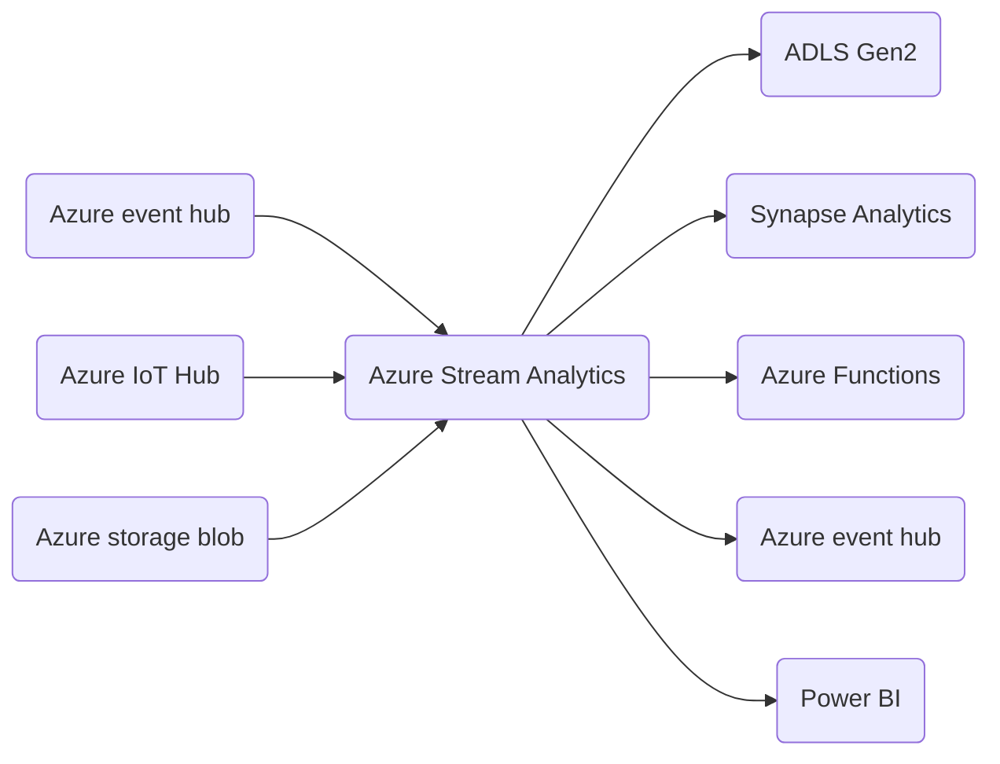
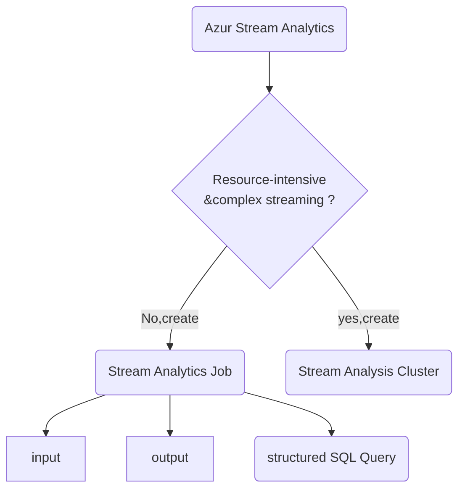
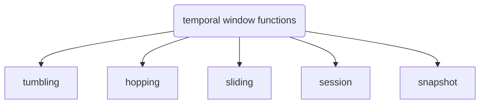
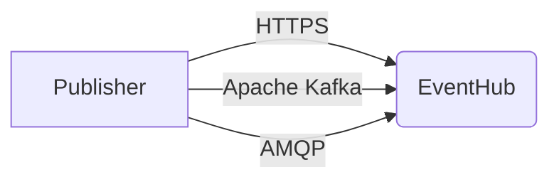

# Microsoft notes

Here are the organized notes from the official website that is available [here](https://learn.microsoft.com/en-us/certifications/exams/dp-203).


Now, let's use a check list to do this

- [ ] Chapter 1
- [x] Chapter 2 Store data in Azure (11/26)
- [ ] Chapter 3
- [ ] Chapter 4
- [ ] Chapter 5
- [ ] Chapter 6
- [ ] Chapter 7
- [ ] Chapter 8
- [x] Chapter 9 Large-Scale Data Processing with ADLS Gen2 (11/26)
- [ ] Chapter 10 Implement a Data Streaming solution with Azure Streaming Analytics

**Table of contents:**

[toc]

# Chapter 1: Azure for the DE x3

some basics.


## Module 1 Understanding the evolving world of data


# Chapter 2: Store data in Azure x5


## Module 1 Choose a data storage approach in Azure

这一个module有些考点的，比较了Azure SQL Database, Azure Cosmos DB, 以及怎么选

In this module, you will learn:

- classify you data as structured, semi-structured or unstructured
- determine how your data will be used
- Determine whether your data requires transactions

### Classify your data

先比较数据库:

- Azure SQL database for structured data
- Azure Cosmos DB for both SQL and noSQL


接下来讲老生常谈的几种类型:

- structured
- semi-structured
  - serialization languate: XML, JSON, YAML
- unstructured
  - Media files
    - photos, videos, audio
  - Microsoft 365 files, `.pptx` and `.word`
  - Text files
  - log files


### NoSQL database

- No SQL database的三类 (Azure Cosmo DB)
  - document
    - stores `markup language` json, xml
  - Key-value
    - stored in key-value pair
    - use `get`,`put`or `delete`
  - Graph database
    - 链式储存


### Determine operational needs


### What is a transaction

A `transaction` is a logical group of database operations that execute together. Transactions often are defined by a set of four requirements called `ACID guarantees`.

问自己: will a change to one piece of data in your dataset affect another piece of data? 


### OLTP vs OLAP


### Reference

里面有几篇文章挺不错的，可以读一下

- [Select an Azure data store for your application](https://learn.microsoft.com/en-us/azure/architecture/guide/technology-choices/data-store-decision-tree)
- [Criteria for choosing a data store](https://learn.microsoft.com/en-us/azure/architecture/guide/technology-choices/data-store-considerations)
- [Non-relational data and NoSQL in Azure](https://learn.microsoft.com/en-us/azure/architecture/data-guide/big-data/non-relational-data)
- [Online transaction processing and Azure](https://learn.microsoft.com/en-us/azure/architecture/data-guide/relational-data/online-transaction-processing)
- [Online analytical processing and Azure](https://learn.microsoft.com/en-us/azure/architecture/data-guide/relational-data/online-analytical-processing)


## Module 2 Create an Azure Storage account

略


## Module 3 Connect an app to Azure storage

略


## Module 4 Secure your Azure Storage account

有些考点，和chapter 9 module 3重复了


## Module 5 Store application data with Azure Blob storage

详细了解一下blob storage, 因为经常考到three blob types, 可以作为stream analytics的input (for static data).

应用角度，比如你是游戏公司程序员，游戏提供功能可以支持玩家自己游戏内截图和视频，玩家可以保存杀死boss时候的images 或者最后击杀的视频，之后直接在游戏内观看，就可以用blob.

### What are blobs?

- 不能query  

- 


### Blob, container, storage account

- blob住在container里，container住在storage account
- container和storage account都是flat, 不能无限套娃


### Blob types♥️

This is what you are gonna be tested on, it has three types:

- `block blob`: are composed of blocks of different sizes that can be uploaded independently and in parallel. Writing to a block blob involves uploading data to blocks and commiting them to the blob. 
- `Append blob`:are specialized block blobs that s**upport only appending** new data (not updating, or deleting existing data), but they are very efficient at it. Great for scenarios like **storing logs or writing streamed data.**
  - 可以用来存log, 因为log只会越来越多
  - 或者streaming solution + ML 出口的reports，也可以append.
- `Page blob`: designed for scenarios that involve random-access reads and writes. Page blobs are used to **store the virtual hard disk (VHD) files** used by Azure Virtual Machines, also great for scenario that involves **random access**.


# Chapter 3: Data integration at scale with ADF or Azure Synapse Pipeline


# Chapter 4: Realize integrated analytical solutions with Azure Synapse Analytics


# Chapter 5: Work with data warehouses using Azure Synapse Analytics


# Chapter 6: Perform data engineering with Azure Synapse Apache Spark Pools


# Chapter 7: Work with Hybrid Transactional and Analytical processing solutions using Azure Synapse Analytics x3


# Chapter 8: Data Engineering with Azure Databricks x5


# Chapter 9: Large-scale Data Processing with ADLS Gen 2 X 3

For better use the insight you could have got from unstructured data 

## Module 1 Introduction to ADLS

In this module

- learn ADLS
- Create an Azure storage account by using Azuring portal
- Compare ALDS Gen 2 and Azure Blob Storage
- Review the use cases for Data Lake Storage


**ADLS Gen2**

- Benefits
  - Hadoop compatible access
    - 和HDFS很相似，直接用Azure Databricks, Azure Synapse Analytics and Azure HDinsight 来处理和分析就可以，不需要moving data between the environment
  - Security
    - Supports access contraol lists (ACLs) and Portable Operating System Interface (POIX) permissions
    - set permissions at a directory or file level.
    - security 可以通过Hive, Spark and Azure storage explorer 来configure
  - Performance
    - organize data with dierarchy of directories (也叫hierarchy namedspace often)
  - Data redundancy
    - with locally redundant storage (LRS) or Geo-redundant storage (GRS)


ADLS 2是基于 blob storage的威力加强版

- supports hierarchy 
- fast I/O

```python
if hierarchical_namespace == "Enabled"
		return "ADLS GEN 2"
else
		return "Azure Blob Storage"
```

ADLS一般是与其它service联合起来运用的, 不同公司的架构，都大同小异，根据业务需求，可以从大数据中挖掘:

- Ingestion
  - **ADF + ADLS Gen 2** for batch movement of data
  - Real-time ingestion of data, **Stream analytics or Apache Kafka for HDinsight  + ALDS Gen 2**
- Store: ADLS Gen2来储存
- Prep and train: Perform data preparation and model tranining and scoring for data science solutions
- Model and serve: 定义为technologies that will present the data to users, 和其它数据库一起such as Synapse, Cosmos DB, Azure SQL Database or Azure analysis service, 然后统一用Power BI来调用


三个azure-based architecture for different companies

- Modern data warehouse
- Advanced analytics on big data
- Real-time analytics


## Module 2 Upload data to ADLS

too ez


## Module 3 Secure your Azure Storage account

In this module

- Explore Azure Data Lake enterprise-class security features
- Undetstand storage account keys
- Understand shared access signatures (SAS)
- Undetstand transport-level encryptions with HTTPS
- Understand Advanced Threat Protection
- Control network access


### Explore Azure Storage features

作为Contoso的DE,  竞争公司有了个data breach, 现在你老板让你检查一遍organization's data security, 你从这五个角度argue Azure的安全性

- Encryption at rest
  - 写入Azure Storage数据库的都有storage service encryption (SSE) with a 256-bit Advanced Encryption Standard (AES) cipher and is **FIPS 140-2 compliant**.
  - 加密解密不收费，而且是强制执行的
  - 对于虚拟机, Azure让你可以对虚拟硬盘 (Virtual hard disks (VHDs)进行加密) 用Azure Disk Encryption
    - for windows images, `Bitlocker`
    - for Linux `dm-crypt`
- Protect the data in transit
- Support browser cross-domain access
- Control who can access data
- Audit storage access
  - 用AZURE的storage analytics services来log every operations in real time


视频的笔记

- secure and auditable to meet bussiness compliance
- 加密通信: encrypyted 256-bit cypher, decypter is automatically
- HTTPS communication protocol (支持加密)
- 三种获得权限的方法level of accesss
  - SAS or key
  - Azure actice directory

- Azure analytics记录发生的一切
  - log every request


### Understanding shared access signature (SAS)

三种数据库权限:

- Account key数据库对于in-house application, 完全放心
- 对于第三方，用SAS, 其实就是一段字符串attached to a URI


### Understand Advanced Threat Protection for Azure Storage

也就是要额外收费的，叫做microsoft defender的一个保护系统，支持

- Blob storage
- azure files
- ADLS Gen 2

可以来检测storage activity anomalies, 同时trigger email to you for warnings!

就在storage account --> security + networking --> Microsoft defender for Cloud

叫这名字也蛮简单的


### Role-based access control (RBAC)

Along with RBAC, 同时也支持access control lists (ACLs) that are POSIX-compliant

> POSIX是什么吊玩意? 


# Chapter 10: Implement a Data Streaming Solution with Azure Streaming Analytics x 3

Learn the concepts of event processing and streaming data, 基本都是time-series data, 可以好好利用起来。

## Module 1 Get started with Azure Stream Analytics


### What is data streaming

streaming data主要来源于IoT和connected applications, some typical examples includes:

- Online stores analyzing real-time clickstream data to provide product recommendations to consumers as they browse the website
- Manufacturing facilities using telemetry data from IoT sensors to remotely monitor high-value assets
- Credit card transcations from point-of-sale systems being scrutinized in real-time to detect and prevent potentially fraudulent activities


Stream data的主要价值为

- Continuously analyzing data to report issues or trends
- Understanding component or system behavior under various condtions to help plan future enhancements
- Triggering specific actions or alerts when certain events occur or thresholds are exceeded

主要流程如下 


### Azure Stream Analytics介绍

Azure stream analytics是一个event processing and analysis of streaming data, 属于PaaS



> 小知识: 从产品定位角度，Azure event hub主要负责大数据，IoT hub主要负责数据量小，和直接连接IoT devices/sensors, see [documentation here](https://learn.microsoft.com/en-us/azure/iot-hub/iot-hub-compare-event-hubs) ; MS官方prefer IoT hub, 支持双向连接, device-to-cloud, cloud-to-device传输command和policies之类的.

怎么用这个platform as a service呢, 看下面流程图




比如现在让你写query, 将weather-event中，<0度的数据写进`cold-temps`中去,

```sql
SELECT 
		event_time, 
		weather_station, 
		temperature
INTO 
		cold-temps
FROM 
		weather-events TIMESTAMP BY event_time
WHERE temperature < 0
```

如果你上游input是IoT Hub或者event hub, 则会自动生成一个`field` to define the arrival time of the event in the queue, 也可以用clause `TIMESTAMP BY`来定义arrival time of the event.

> Field (default) 也可以被TIMESTAMP BY来overwrite


### Understand Window Functions

Stream processing的目的是aggregate events into temporal intervals, or windows, 比如计算每分钟有多少条推特post, 或者每小时平均降雨量。Azure stream analytics支持五种temporal windowing functions, enable you to define temporal intervals into which data is aggregated in a query.



> 小贴士: 这里的winfow function与SQL中的`count() over(partition by xxx order by xxx)`


#### Tumbling

Tumbling window function segments data stream into a contignuous series of fixed-size, non-overlapping time segments. The schematics is illustrated in the figure below


可以注意到，每一个time segment时长一致且不重复;

现在我们看下面这个例子，

```sql
SELECT 
		EventName,
    COUNT(*) AS Count
FROM 
		EventStream TIMESTAMP BY EventTimestamp
GROUP BY EventName, TumblingWindow(minute, 10)
```

clause `TumblingWindow(time unit,size)`与clause `group by`连用，计算时间是default设定是左开右闭区间 (12:00am, 12:10am], 但可以通过`Offset` parameter来调.


#### Hopping

Hopping window functions实际上是moving average的generalized case. Hopping window functions, 代表着scheduled overlapping windows, jumping forward in time by a fixed period. 流程图如下:


那我们再看一下同样的例子,

```sql
-- Count the number of times each event occurs every 10 seconds
SELECT 
		EventName, 
		COUNT(*) AS Count
INTO 
		OutputData
FROM EventStream TIMESTAMP BY EventTimestamp
GROUP BY EventName, HoppingWindow(second, 10, 5)
```

可以看到这个clause `HoppingWindow(time unit, size, hopsize)` 和`group by` 连用

实际上HoppingWindow是TumblingWindow的一个general case:

`HoppingWindow(minute,10,10)` = `TumblingWindow(minute,10)` 

同时某个参数的每10秒发生的moving average可以用aggregate function + hopping window来求；


#### Sliding

Azure Stream Analytics定义sliding window为, 一个event enter or exit你的temporal interval.  也就是说，每个window的生成条件是，一个event进入或者离开定长的时间窗口, 如下图所示


Example: find events that have happened more than three times in the last 10 mins

```sql
SELECT
    DateAdd(minute,-5,System.Timestamp()) AS WinStartTime,
    System.Timestamp() AS WinEndTime,
    EventName,
    COUNT(*) AS Count
INTO OutputData
FROM EventStream TIMESTAMP BY EventTimestamp
GROUP BY EventName, SlidingWindow(minute, 10)
HAVING COUNT(*) > 3
```


#### Session

session window function 会做:

- Cluster events together that arrive at similar times
- Filtering out periods of time where there is no data

`SessionWindow()` 有three primary parameters

-  timeout
-  maximum duration
- Partitioning key (optional)

The schematics is shown below,


下面的例子 measures user session length by creating a `SessionWindow` over clickstream data with a `timeoutsize` of 5 minutes and a `maximumdurationsize` of 60 mins.

```sql
-- Output the count of events that occur within 2 minutes of each other with a maximum duration of 60 minutes.
SELECT
    Username,
    MIN(ClickTime) AS WindowStart,
    System.Timestamp() AS WindowEnd,
    DATEDIFF(s, MIN(ClickTime), System.Timestamp()) AS DurationInSeconds
INTO OutputData
FROM Clickstream TIMESTAMP BY ClickTime
GROUP BY Username, SessionWindow(minute, 2, 60) OVER (PARTITION BY Username)
```

换通俗点讲, 5分钟没event进来就close window了 (filter out了)，或者超过window总时长超过60mins, 也close window了。

 

#### Snapshot

**Snapshot** windows groups events by identical timestamp values. 直接连用`group by`和`System.Timestamp()`即可

```sql
SELECT 
		EventName, 
		COUNT(*) AS Count
INTO OutputData
FROM EventStream TIMESTAMP BY EventTimestamp
GROUP BY EventName, System.Timestamp()
```

具体的flowchart,


### Exercise

略, 需要花15分钟。


### Summary

Azure Stream Analytics is a platform-as-a-service (PaaS) that you can use to process a perpetual stream of data for real-time reporting, automated action or integration into an enterprise analytical solution.

You learned so far

- Understand data streams
- Understand event processing
- Get started with Azure Stream Analytics

For more deatils, refers the [Azure Stream Analytics Documentation](https://learn.microsoft.com/en-us/azure/stream-analytics/)


## Module 2 Enable reliable messaging for Big Data applications using Azure Event Hub

Azure Event Hub, a big data streaming platform and event ingestion service, it can receive and process millions of events per second.

In this module, you will:

- Create an event hub using the Azure CLI
- Configure apps to send or receive messages through an event hub
- Evaluate your even hub performance using the Azure portal


## Create an Event Hub using the Azure CLI

Event hub acts as a front door for an event pipeline, to receive incoming data and stores this data until processing resources are available.


流程图如上,一些注释

- `Publisher`: an entity that sends data to event hub
- `Subscriber (Consumer)`: an entity that reads data from event hub

- 和staging area的功能很类似，实际上是为了防止$r_{production} \gg r_{consumption}=\frac{\partial C}{\partial t}$ , 做了一个buffer, 可以短期储存或者处理

- `Event`: a small packet of information (也叫datagram) that contains a notification, 可以individually publish, 也可以形成一个mini-batch后publish, 但有个限制条件single publication 不能大于1 MB (be is individual or batch)

  

   

### Publisher and Subscriber

Publisher传输event or datagram的方式有三种协议:

- HTTPS
- Apache Kafka
- Advance Message Queuing Protocol (AMQO)



几种优缺点比较

|          | HTTPS                                                        | AMQP                                                         | Apache Kafka                                       |
| -------- | ------------------------------------------------------------ | ------------------------------------------------------------ | -------------------------------------------------- |
| 优缺点   | More overhead for each request, but no initialization overhead | Higher initial session overhead (需要set up persistent bidiretional socket, transport-level secutiry (TLS)) | eventub endpoint兼容Kafka producer & consumer APIs |
| 应用场景 | For publisher requires intermittent publishing               | For publisher frequently send data, better performance       |                                                    |

### Event hubs namespace

创建event hub 分两步:

1. define 一个 event hubs namespace (container)
2. Create an event hub inside the namespace


## Module 3 Ingest data streams with Azure Stream Analytics

In this module, you will learn:

### Understand stream processing

Data stream需要做很多temporal operations such as windowed aggregates, temporal joins and temporal analytic functions to measure changes or differences over time.


### Azure Stream Analytics

计算资源单位为Streaming Units (SUs)
