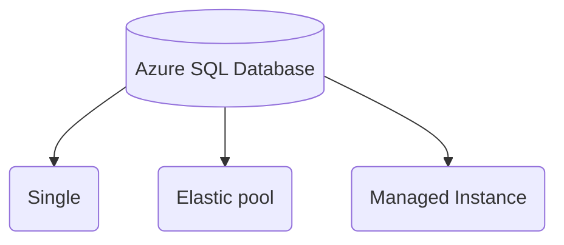
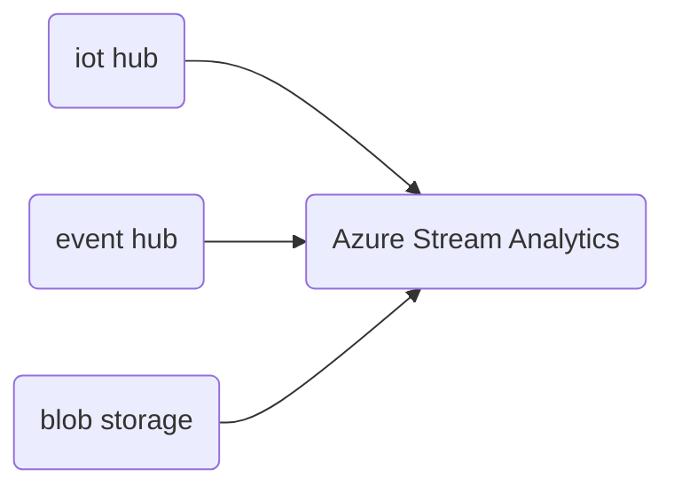

# Master cheatsheet

This is a 

[toc]

Questions:

- What's the difference among Azure SQL database single, managed instance and pooled database?

## Data access tier

还记得之前学过的，hot, cold and archive tier吗

|                   | hot  | cold | archive |
| ----------------- | ---- | ---- | ------- |
| Storage cost      |      |      |         |
| access cost       |      |      |         |
| Note and keywords |      |      |         |

## Data distribution

| Azure Data Warehouse (现在叫做Dedicated SQL Pool) | Data Distribution | Reason                   | Fit for                                                     |
| ------------------------------------------------- | ----------------- | ------------------------ | ----------------------------------------------------------- |
| Small Dimension Table                             | Replicated        | usually data size < 2 GB | Star schema with less than 2GB of storage after compression |
| Temporary/Staging Table                           | Round Robin       | Data size <5GB           | No obvious joining key or good candidate column             |
| Fact Table                                        | Hash distributed  | Data size > 100GB        | Large dimension tables                                      |

和官方documentation有些出入

- Using a `hash distribution`
  - the table size on disk is more than 2 GB
  - the table has frequent `insert`, `update` and `delete` operations

## Table index

| Type                                   | Fit for                                                      |
| -------------------------------------- | ------------------------------------------------------------ |
| Heap                                   | Staging or temporaty table, small tables with small lookups  |
| Clustered index                        | Tables with up to 100 million rows, large tables (> 100 million rows) with only 1-2 columns heavily used |
| Clustered column store index (Default) | Large tables (more than 100 million rows)                    |

**Heap** is illustrated below, Heap的特点如下:

- data is not stored in any particular order
- Specific data can not be retrievered quickly 
- Data pages are not linked, so sequential access needs to refer back to the index allocation map (IAM) pages

**Clustered index** 是一个binary tree with indexing, 这样你找起数据来来比较方便.

- Data is stored based on the clustered index key
- Data can be retrieced quickly based on the clustered index key (需要付出一些空间来存储clustered index tree, 但得到了查询速度上的提升，以空间换时间)
- data pages are linked for faster sequential access

也可以看这张图

> 小知识: 默认的比较好的储存文件格式是parquet, prefered index type通常是clustered columnstore.

- [sql-shark](https://www.sqlshack.com/wp-content/uploads/2019/06/basic-clustered-index-binary-tree-b-tree-storage-1.png)
- [ms-learn](https://learn.microsoft.com/en-us/sql/relational-databases/indexes/heaps-tables-without-clustered-indexes?view=sql-server-2017)
- [very good comparision between clustered table and regular table](https://www.mssqltips.com/sqlservertip/1254/sql-server-clustered-tables-vs-heap-tables/)

## Azure databrick Cluster configuration

Azure databrick用的是spark内核，cluster的configuration推荐如下:

| -                      | Standard                 | High Concurrency               |
| ---------------------- | ------------------------ | ------------------------------ |
| **Recommended for**    | Single User              | Multiple Users                 |
| **Language support**   | Sql, Python, R and Scala | SQL, Python, and R (not Scala) |
| **Notebook isolation** | No                       | Yes                            |

Notebook isolation refers to the visibility of variables and classes between notebooks.

## Azure Data Factory Triggers

ADF trigger的常见类型和应用场景如下

| Type            | Description                                                  |
| --------------- | ------------------------------------------------------------ |
| Schedule        | Runs on a wall-clock schedule (e.g. every X mins/h/d/w/m's)  |
| Tumbling Window | A series of fixed-sized, non-overlapping, and contiguous time intervals |
| Event-based     | Runs pipelines in response to an event (e.g. blob created/deleted) |

会考到问你ADF有哪几种trigger, 背下来就好:

- Schedule trigger: 按真实时间，定时trigger, 类似于crontab
- Tumbling window: 在azure event hub的window funcitons学习过, 一系列等长，不重叠的时间窗口
- Event based: 根据某些事情的发生作为trigger, 比如东西生成

## Azure Data Favtory Integration Runtime (IR) Usage

关键词: Integration runtime (IR)

| IR Type     | Public network                              | Private network                  |
| ----------- | ------------------------------------------- | -------------------------------- |
| Azure       | Data Flow; Data movement; Activity dispatch | -                                |
| Self-hosted | Data movement; Activity dispatch            | Data movement; Activity dispatch |
| Azure-SSIS  | SSIS package execution                      | SSIS package execution           |

考过的点:

- 问你这三种IT Type的判断题，记住Types are `Azure`, `Self-hosted`,`Azure SSIS`即可
- 问你在private network里, copy telemetry data from blob storage to gen 2, 你用哪种IR?

## Azure SQL Database hosting/depolyment options

Azure SQL Database常考到类型

|                 | single                                                       | Elastic pool                                                 | Managed instance                                             |
| --------------- | ------------------------------------------------------------ | ------------------------------------------------------------ | ------------------------------------------------------------ |
| **Description** | Database-scoped depolyment option with predictable workload performance | Shared resource model optimized for greater efficiency of **multi-tenant applications** | Instance-scoped depolyment option with **high compatibility with SQL server** and full PaaS benefits |
| **应用场景**    | Best for apps that require resource guarantee at database level | Best for SaaS apps with multiple databases that can share resources at database level, achieving better cost efficiency | Best for modernization at scale with low friction and effort 也就是很适合移植以前用on-prem MS SQL server的用户 |

### Azure SQL Database - backups

Backup frequencies:

- `Full backups` every week
- `Differential backups` every 12 or 24 hours
- `Transaction log backups`: approximately every 10 minutes

记得补下面的notes

- [Documention: Automated backups in Azure SQL Database](https://learn.microsoft.com/en-gb/azure/azure-sql/database/automated-backups-overview?tabs=single-database&view=azuresql)

## Azure SQL Database - Security Overview

总体分成几个layers

| Layer                  | Type                                  | Description                                                  |
| ---------------------- | ------------------------------------- | ------------------------------------------------------------ |
| Network                | IP Firewall Rules                     | Grant access to databases based on originating IP address of each request; 比如中国的墙 |
| Network                | Virtual Network Firewalls Rules       | Only accept communications that are sent from selected subnets inside a virtual network (**这啥意思?**) |
| Authorization          | Row-level security                    | Contraol access to rows in a table based on the characteristics of the user/query. |
| Threat Protection      | Auditing                              | Tracks database activities by recording events to an audit log in an Azure storage account |
| Threat protection      | Advanced Threat Protection            | Analyzing SQL Server logs to detect unusual and potentially harmful behavior. (也就是数据的**anomaly detection**) |
| Information Protection | Transport Layer Security (TLS)        | Encryption-in-transit between client and server              |
| Information Protection | **Transparent Data Encryption (TDE)** | Encryption-at-rest using AES (Azure SQL DB encrypted by default都是自动加秘的，不需要多想) |
| Information Protection | **Dynamic Data Masking (DDM)**        | Limits sensitive data exposure by **masking it to non-privileged users.** (真题考过DDM怎么limit exposure of sensitive data) |
| Information Protection | Vulnerabiliity Assessment             | Discover, track, and help remediate potential database vulnerabilities |

### Encryption on Azure

In AZURE,

| Type                | Technique or service used   | Enables encryption of                    |
| ------------------- | --------------------------- | ---------------------------------------- |
| Raw Encryption      | -                           | Azure storage, VM Disks, Disk Encryption |
| Database Encryption | Transparent Data Encryption | Databases and SQL DW (SQL pool)          |
| Encrypting Secrets  | Azure Key Vault             | Storing application secrets (比如秘钥等) |

## Azure HDInsight cluster types to run Apache Hive Queries

关键词: HDInsight cluster type, Apache hive queries

| Cluster Type          | Usage                                                   |
| --------------------- | ------------------------------------------------------- |
| **Interactive Query** | To **optimize for ad hoc**, interactive queries         |
| Apache **Hadoop**     | To optimized for hive queries used as **batch process** |
| Spark & HBase         | Run hive queries                                        |

##  应试Hacks!!!

这是一个应急的section, 只有当你非常不确定某些问题的答案的时候，你需要用以下的做题技巧

- `IOT Hub`, `Event Hub`, `Blob` are three ways to bring data into Stream Analytics (T1Q41,)

- 关键词里有hierarchical或者big data related storage则选择`ADLS Gen2`
- 关键词里有flat related storage (数据都在同一层，同一个namedspace), 则`blob`

# Practice Set 1

学习策略将练习题分成以下几类:

- 0 - 触及知识盲区
- 1 - 有些印象, 但需要回顾
- 2 - 很自信，但做错了

试题学习:

- 1: **因为**关键词several apps from on-premises and SQL database + low migration effort, **则** SQL database managed instance
- 2: **因为**关键词several apps from on-premises and SQL database  **则** SQL database managed instance
- 9: Dedicated SQL pool in Azure Synapse Analytics 的firewall问题[documentation](https://learn.microsoft.com/en-gb/azure/synapse-analytics/sql-data-warehouse/sql-data-warehouse-overview-manage-security)
  - Server-level IP firewalll 支持☑️
  - database-level IP firewall 不支持❌
- 10: Long-term rention (LTR), 关键词10年

- 19: role-based中的`db_accessadmin` 的权限的判断题
- 20: `db_backupoperator`
- 21: `db_owner`
- 22: Azure SQL Database uses SQL server technology的backup问题
  - 多久做一次differential backups
  - 多久做一次full backups
  - 多久做一次transcation log backups
- 23: **Transparent Data Encryption (TDE)** on Microsoft SQL Server
- 33: 与22很类似，问了Azure SQL Database的backup问题
  - 1
  - 2
  - 3
- 34: what is the key advantage to choose an Azure SQL database over a SQL server hosted on a Virtual Machine (IaaS)
  - 你的app产品发布更快
- 37: Azure blob type有哪些啊，优势分别是?
- 39: Azure SQL deployment options??
- 42: which service for **compatibility assessment** of on-prem Microsoft SQL database?
  - Data Migration Assistant (DMA)

## 错题集

2, **9, 10, 11**, **22**, **34, 39, 42, 45**

- 2: **因为**关键词several apps from on-premises and SQL database  **则** SQL database managed instance
- 9: Dedicated SQL pool in Azure Synapse Analytics 的firewall问题[documentation](https://learn.microsoft.com/en-gb/azure/synapse-analytics/sql-data-warehouse/sql-data-warehouse-overview-manage-security)
  - Server-level IP firewalll 支持☑️
  - database-level IP firewall 不支持❌
- 10: back up的Long-term rention (LTR), 关键词10年
- 11: hash-distributed table in Synapse SQL pools中的关键词: 表格大小大于2GB + 频繁的`Insert`,`Update`,`Delete`
- 22: Azure SQL Database uses SQL server technology的backup问题
  - 多久做一次differential backups: 每12小时
  - 多久做一次full backups: 每周
  - 多久做一次transcation log backups: 5-10分钟
- 34: what is the key advantage to choose an **Azure SQL database** over a **SQL server hosted on a Virtual Machine (IaaS)**
  - 你的app产品发布更快 (企业更关心)
- 39: Azure SQL deployment option:
  - 一看到甲方爸爸的需求是 full control over the SQL server engine, 啥也别说了，只能是虚拟机了。虚拟机要维护起来很麻烦，那你的调里面很多config.
- 42: which service for **compatibility assessment** of on-prem Microsoft SQL database? 反正碰到**数据库迁移**就用DMA就
  - Data Migration Assistant (DMA)
- 45: databrick中为了regional disaster recovery你需要
  - geo-redudant storage
  - **provision** multiple **Azure DB workspaces** in **separate Azure regions**
  - Once secondary region is created, **you must migrate** user, user folder, cluster configutation etc

## Review的题

**9, 10, 11**, 19, 20, 21, **22**, 23, 27, **34, 39, 42, 45**

Unique的题目是

- 19:`db_accessadmin`: can add or remove access to the database for Windows logins, Windows groups, and SQL Server logins.
- 20:`db_backupoperator`:fixed database role can back up the database.
- 21:`db_owner`: perform all configuration and maintenance activities on the database, and can also drop the database in SQL Server.
- 23: 考点是TDE, 其实算做错了，因为漏选了一项，仔细过一遍[Documentation transparent data encryption (TDE)](https://learn.microsoft.com/en-gb/sql/relational-databases/security/authentication-access/media/permissions-of-database-roles.png?view=sql-server-ver15)
  - database encryption key (DEK) 什么玩意
- 27: 考点是blob storage, [Documentation blob](https://learn.microsoft.com/en-us/azure/storage/blobs/storage-blobs-introduction)
  - block blob for unstructured data such as videos, pictures
  - page blob for VM hard disks

19-21考点是fixed-database roles, 看[documentation database-level roles](https://learn.microsoft.com/en-gb/sql/relational-databases/security/authentication-access/database-level-roles?view=sql-server-ver15#fixed-database-roles)

 可能的考点挺多的，高频的记住就可以了

23考点TDE, 也就是udemy course中，创建external source in Synapse需要建立的一系列繁琐的master key, scoped credential

27 blob storage细节考点 [Documentations: Blob types](https://learn.microsoft.com/en-us/rest/api/storageservices/understanding-block-blobs--append-blobs--and-page-blobs?source=recommendations)

- blob storage service有三个types:
  - block blob
  - append blob
  - page blob

# Practice Set 2

学习策略将练习题分成以下几类:

- 0 - 触及知识盲区
- 1 - 有些印象, 但需要回顾
- 2 - 很自信，但做错了

- Event hub vs IoT hub?
- 

## 错题集

**1**,4,5, **9,10**,**11,14**, **18, 23, 31,** 34, **36**,43, 45, 49, **50**

- 1: `HDinsight spark/storm/hadoop cluster` VS `Azure stream`
  - 
- 4: Azure Databricks
- 5: 安全, 正确答案是`column-level` security
  - `column-level security`: allows customers to control access to table columns based on the user's execution context or group membership
  - `row-level security`: user group membership or exexution context to control access to rows in a database table
  - `Transport layer secutiry`: data in transit
- 9: AZ DB的premium service tier提供了:
  - Audit logs
  - Role-based access control for notebooks, clusters, jobs and tables
- 10: integration runtime三种type选择的问题
  - `Azure`: 如果题目里有copy data between two different Azure cloud且非常安全，则
  - `Self-hosted`: support data stores that require bring-your-own driver such as SAP Hana, MySQL etc.
  - `Azure-SSIS`
- 11: 同上题
- 14 : ??? Azure stream analytics, 如果你在stream中，需要用到reference data, 则用blob storage, 因为blob storage是支持streaming的
- 18: stream solution + ML 则Azure Stream Analytics
- 23: ???
- 31: event hub vs IoT hub
- 34: Azure DB的output是一系列records, wirtten to Cosmos DB using the Cassandra API (支持time-series data modeling)
- 36
- 43: page blob vs block blob
  - 这题要求solution for storing VM disks, 要用page blob
- 45: 如果managed hadoop service 则Azure HDinsight
- 49: for data loading, use `Round-robin distributed table` 为什么
- 50: Azure SQL database三种deployment的问题

## Review的题

**1,9,10,11,14,18,23,31**,**36**,37,38,**50**

- 37
- 38
