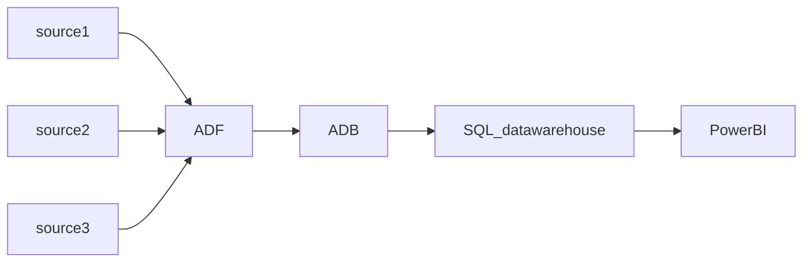
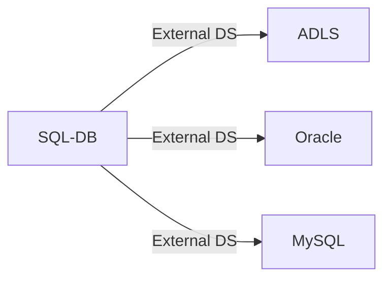
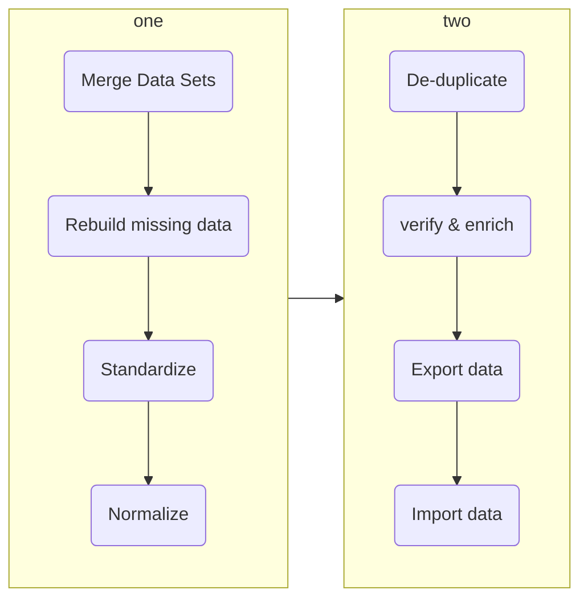
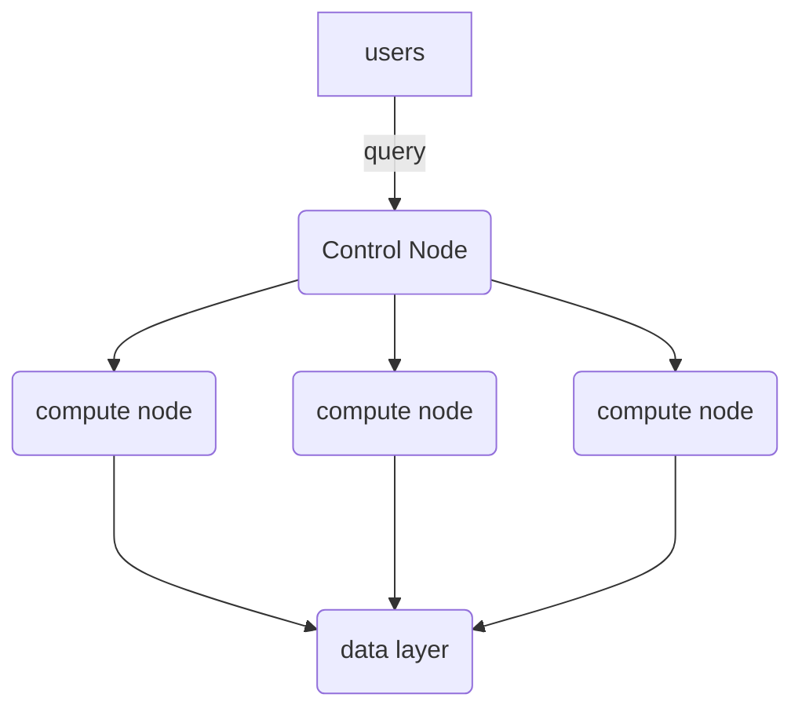
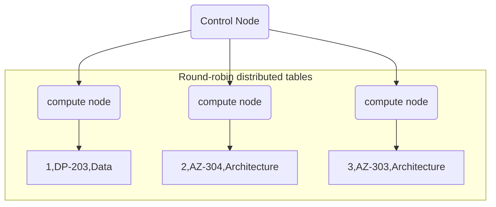
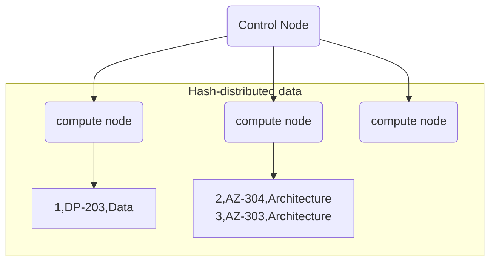
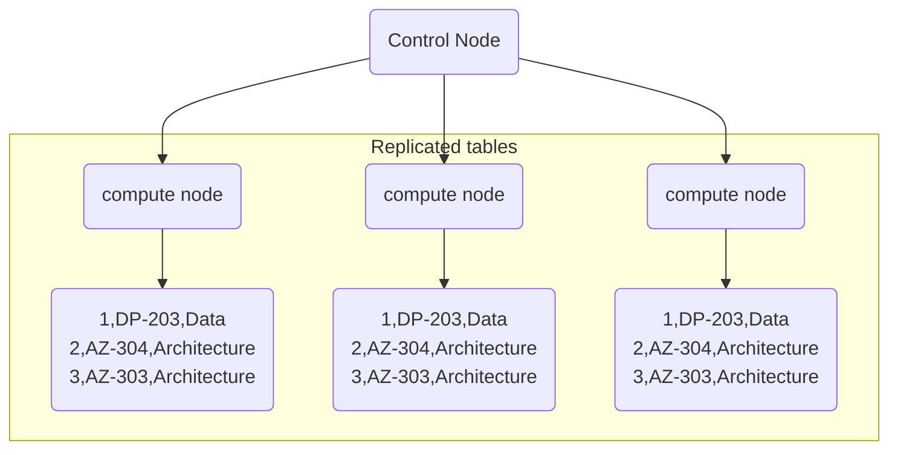

# Section 4 Datawarehouse with Azure Synapse Analytics

这一section,主要介绍Azure synapse service, 主要的reference来源于Udemy paid course和[youtube resource by wafastudies](https://www.youtube.com/watch?v=Qoatg-SPpe4&list=PLMWaZteqtEaIZxPCw_0AO1GsqESq3hZc6)


**Table of contents:**

[toc]

# Azure synapse基本介绍


## Azure Synapse Analytics

Azure Synapse 是最新的一个捆绑service (Platform as a service), 捆绑了以下的服务

- SQL technologies used in data warehousing (Synapse SQL) 吞并了Azure Datawarehouse
- Spark technologies used in Bigdata (Apache Spark)
- Pipelines for data integration and ELT/ETL (ADF)

 之前的服务是这样的



Where ADF is Azure data factory, ADB the Azure databrick

Synpase 也就是把ingestion, integration, ETL和储存服务，都用一个service来包括了, 如下图


说白了，做这个synapse analytics的核心意义是:

- 将多个service合并起来，来简化操作(并没有这么觉得，反而complicate things)
- 增加用户粘性


Adam做的这张示意图更清晰一点:

- Azure Synapse Analytics是一个unifined studio融合了
  - Pipelines (ADF的ETL功能)
  - Spark core (for data transformation)
  - Synapse SQL
    - SQL pools (dedicated)
    - Serverless SQL (ad-hoc)


reddit dataengineering subreddit网友表示:

- still prefer databrick
- synapse seems like a rush job and less polished


### Synapse 架构

Azure Synapse里有两种compute options

- **SQL Pool**
- **Serverless SQL pool**
- Apache spark pool (not covered here)

Azure Synapse的架构如下


### Azure Synapse Analytics

**Overview:**

- Synapse workspace
- Linked Service
- Synapse SQL
- Apache Spark for synapse
- Pipelines


**Synapse workspace**

- Workspace is a collaboration place for doing cloud-based enterprise analytics in Azure
- A workspace 需要和ADLS一起创建, 1-to-1连接


**Linked Service**

- 连接内/外部数据库的方法,连接后可以直接在workspace里面access


**Synapse SQL**

- Synapse SQL is the ability to do T-SQL based analytics in Synapse workspace
- Synapse SQL has two consumption models: dedicated and serverless
- Synapse SQL Pools actually helps you to run SQL scripts


**Apache Spark for synapse**

- Gives the ability to do Spark based analytics in Synapse Workspace
- Create Apache spark pools才能开始处理
- two ways to use it
  - Notebooks
  - jar

**Pipelines**

- pipelines are how Azure synapse provides data integration (logical group of activities)


## **Lab** External table in serverless SQL Pool

Lab: create an external table in serverless SQL pool

External table concepts

- 在Azure Synapse有一个概念叫做external table, 也就是access data from external database
- 应用场景是，你只想要access某些在别的数据库中的数据，不想要把数据copy over到本地的database中来，可以用这个功能
- The data lies in another source and we just defined the table structure in Azure Synapse
- 需要的步骤很简单:
  - 创建一个database
  - 创建一个Master key
  - 决定你需要连接的权限方式 （SAS for example）
  - 找到你想到的container的link


```sql
-- drop db if exists
DROP DATABASE appdb;

CREATE DATABASE [appdb]

-- Here we are creating a database master key. This key will be used to protect the Shared Access Signature which is specified in the next step
-- Ensure to switch the context to the new database first

CREATE MASTER KEY ENCRYPTION BY PASSWORD = 'P@ssw0rd@123';

-- Here we are using the Shared Access Signature to authorize the use of the Azure Data Lake Storage account

CREATE DATABASE SCOPED CREDENTIAL SasToken
WITH IDENTITY='SHARED ACCESS SIGNATURE'
, SECRET = '?sv=2021-06-08&ss=bfqt&srt=sco&sp=rl&se=2022-11-25T07:07:32Z&st=2022-11-24T23:07:32Z&spr=https&sig=%2BSocArrfRCi39MArj0hbxQeya8dUyAroJhYeQ7dAazo%3D';

-- This defines the source of the data. 

CREATE EXTERNAL DATA SOURCE log_data
WITH (    LOCATION   = 'https://datalake0329.blob.core.windows.net/data',
          CREDENTIAL = SasToken
)
-- https://datalake0329.blob.core.windows.net/data/raw/Log.csv


/* This creates an External File Format object that defines the external data that can be 
present in Hadoop, Azure Blob storage or Azure Data Lake Store

Here with FIRST_ROW, we are saying please skip the first row because this contains header information
*/

CREATE EXTERNAL FILE FORMAT TextFileFormat WITH (  
      FORMAT_TYPE = DELIMITEDTEXT,  
    FORMAT_OPTIONS (  
        FIELD_TERMINATOR = ',',
        FIRST_ROW = 2))

-- Here we define the external table

CREATE EXTERNAL TABLE [logdata]
(
    [Id] [int] NULL,
	[Correlationid] [varchar](200) NULL,
	[Operationname] [varchar](200) NULL,
	[Status] [varchar](100) NULL,
	[Eventcategory] [varchar](100) NULL,
	[Level] [varchar](100) NULL,
	[Time] [datetime] NULL,
	[Subscription] [varchar](200) NULL,
	[Eventinitiatedby] [varchar](1000) NULL,
	[Resourcetype] [varchar](1000) NULL,
	[Resourcegroup] [varchar](1000) NULL)
WITH (
 LOCATION = '/raw/Log.csv',
    DATA_SOURCE = log_data,  
    FILE_FORMAT = TextFileFormat
)

-- If you made a mistake with the table, you can drop the table and recreate it again
DROP EXTERNAL TABLE [logdata]

SELECT * FROM [logdata]

SELECT [Operationname] , COUNT([Operationname]) as [Operation Count]
FROM [logdata]
GROUP BY [Operationname]
ORDER BY [Operation Count]

```


## External Data Source

External data sources are used to establish connectivity with external reousrces such as Azure storage.



  access的顺序为

- Master key
  - scoped credential

- External data source
- External file format (csv, parquet)
- External table
- Done! U can now select as you need


## Lab SQL pool

Dedicated SQL pool, 原来叫做Azure SQL Data Warehouse, 变成part of Synapse了. It is measured in **data warehousing units (DWU)**.


Server url 有点问题，报错`Schema of the input URL is not supported. Please revise the following schema and try again.`


## Dedicated SQL pool vs Serverless SQL pool

| -              | serverless pool                                              | SQL pool                                                     |
| -------------- | ------------------------------------------------------------ | ------------------------------------------------------------ |
| Application    | for ad-hoc analysis to create external tables                | for repeated access to the same amount of data               |
| Price          | pay per TB processed                                         | Per DWU provisioned                                          |
|                | Data is stored in relational tables                          | Data is stored in Data Lake                                  |
| Cost reduction | Cost is managed by pasuing SQL pool or scaling down warehouse | Cost is automatically handled and invoiced on a pay-per-query basis |


## Cleansing data

This is the process of finding and correcting/removing corrupt or inaccurate records in a record set.

Common rules are:

- What do you do with rows that have columns with Null values?
- What do you do with records that have duplicate row values?
- Formatting dates, different systems might store dates in different formats

Please see the rich diagram below.




## Loading data into Dedicated SQL Pool

Dedicated SQL pool, 以前叫sql warehouse, 实际上是给OLAP服务的database, 和平时我们insert, update, delete等是在OLTP database做的


# Designing a data warehouse

ERD is for database of OLTP, but for OLAP of data warehouse 首先了解两个概念，Fact Tables和Dimension tables (star schema, snowflake schema)


|          | Fact Tables                                                  | Dimension                                                    |
| -------- | ------------------------------------------------------------ | ------------------------------------------------------------ |
| 简单介绍 | Contains the **measurement of business processes** and it contains FK for the dimension tables. | contains **attributes of the measurements** stored in fact table |
|          |                                                              |                                                              |
|          |                                                              |                                                              |


- Load dimension table first, then fact tables. 
  - 因为fact tables需要定义foreign key，但foreign key需要有dim table的PK才能一一对应，没有dim table, 也就没有dim table PK, 也就不能定义fact tables的FK, 综上所述，需要先定义dim table


这一章会教我们，怎么做一个fact table和dimension table. 


Star schema的具体例子如下，dimtables围绕着fact table, 犹如星星一样, 这就叫做star schema, 这么做的目的是在OLAP warehouse中提高query速度。


## Facts Table and Dimension tables

Facts table储存信息，dimension tables give context to it so we can understand data.


- Fact tables
  - It contains measurements, facts or metrics of the attributes
  - Hold no meaning in itself
  - Numeric and quantifiable
  - Created or loaded after dimensions are loaded
  - Primary Key is a new column identifying the unique row, references dim tables with FK
- Dimension tables:
  - Give context to fact, holds attributes for the facts
  - Created or loaded before facts are loaded
  - Primary key is referenced by fact tables


### Star Schema VS Snowflake Schema

Snowflake实际上就是无限套娃, set of normalized dimension tables.


## Lab Dimensional modeling

见lab folder for detail;


## Dedicated SQL pool architecture

有60多种table distribution在dedicated SQL pool (data warehouse(~PB, bulk insert)), 由于数据量和OLTP的数据库(~TB, many inserts and deletes)的管理的数据量不一样和读写规律不一样，自然数据的储存也需要一些优化方式。




>  什么是distributed table? A distributed table appears as a single table, but the rows are actually stored across 60 distributions. The rows are distributed with a **hash** or **round-robin** algorithm.


## Different table types

不同的distribution其实就是different ways to partition data in your data warehouse.


这里介绍三种distribution, example data in datawarehouse如下

| Id   | Course | Category     |
| ---- | ------ | ------------ |
| 1    | DP-203 | Data         |
| 2    | AZ-304 | Architecture |
| 3    | AZ-303 | Architecture |


### Round-robin distributed tables

- This type of table distributed the rows evenly across all distributions
- General rule of thumb for round robin
  - No `Joins`
  - no clear candidate column for hash, then round-robin
  - temporary staging tables can use this table type

One row for each compute node, 这样的分配数据方法improves loading speed. 这也同时是default type with the symbol `dbo.dimCustomer`.



> `DBCC PDW_SHOWSPACEUSED('[DBO].[SalesFact]')` 你可以用这条command, 来看table的distribution

在你的dedicated SQL pool中，你run this command will pop up, header row的意义分别是:

| Name            | Description                                                  |
| --------------- | ------------------------------------------------------------ |
| ROWS            |                                                              |
| RESERVED_SPACE  |                                                              |
| DATA_SPACE      |                                                              |
| INDEX_SPACE     |                                                              |
| UNUSED_SPACE    |                                                              |
| PDW_NODE_ID     | 在哪个node里储存，由于我们DWU(data warehouse unit)选的很小，估计就分配给我们一个资源，所以都是1 |
| DISTRIBUTION_ID |                                                              |


```markdown
ROWS RESERVED_SPACE DATA_SAPCE INDEX_SPACE UNUSED_SPACE PDW_NODE_ID DISTRIBUTION_ID
2397	272	176	16	80	1	1
2397	272	176	16	80	1	2
3196	336	224	16	96	1	3
2809	272	200	16	56	1	4
2397	272	176	16	80	1	5
2397	272	176	16	80	1	6
2397	272	176	16	80	1	7
3196	336	224	16	96	1	8
3995	400	280	16	104	1	9
3608	336	256	16	64	1	10
2809	272	200	16	56	1	11
2397	272	176	16	80	1	12
3196	336	224	16	96	1	13
3196	336	224	16	96	1	14
2809	272	200	16	56	1	15
2397	272	176	16	80	1	16
2397	272	176	16	80	1	17
3196	336	224	16	96	1	18
3714	336	256	16	64	1	19
2809	272	200	16	56	1	20
2010	272	152	16	104	1	21
2397	272	176	16	80	1	22
2397	272	176	16	80	1	23
2397	272	176	16	80	1	24
2010	272	152	16	104	1	25
1598	208	120	16	72	1	26
1598	208	120	16	72	1	27
1598	208	120	16	72	1	28
1598	208	120	16	72	1	29
1598	208	120	16	72	1	30
1211	208	96	16	96	1	31
799	144	72	16	56	1	32
799	144	72	16	56	1	33
412	144	48	16	80	1	34
799	144	72	16	56	1	35
799	144	72	16	56	1	36
799	144	72	16	56	1	37
799	144	72	16	56	1	38
799	144	72	16	56	1	39
799	144	72	16	56	1	40
799	144	72	16	56	1	41
1598	208	120	16	72	1	42
1598	208	120	16	72	1	43
1598	208	120	16	72	1	44
1598	208	120	16	72	1	45
1598	208	120	16	72	1	46
1211	208	96	16	96	1	47
1598	208	120	16	72	1	48
1598	208	120	16	72	1	49
1598	208	120	16	72	1	50
1598	208	120	16	72	1	51
2397	272	176	16	80	1	52
2397	272	176	16	80	1	53
2010	272	152	16	104	1	54
1598	208	120	16	72	1	55
1598	208	120	16	72	1	56
1598	208	120	16	72	1	57
2397	272	176	16	80	1	58
3196	336	224	16	96	1	59
2809	272	200	16	56	1	60
```

 接下来你run这个command, 由于SQL是declarative language, 后面的是实际运行的方法;

```sql
-- If you execute the below query
SELECT 
		[CustomerID],
    COUNT([CustomerID]) AS [COUNT] 
FROM 
		[dbo].[SalesFact]
GROUP BY [CustomerID]
ORDER BY [CustomerID]

```


### Hash-distributed data

- A hash-distributed table takes the data and distributes the rows across the compute notde. The distribution of data is done via a deterministic hash function that assigns each row to one distribution.
- Choose a **distribution column** as the `hash value` on each compute node.
- Consider using hash-distribution table if the table size > 2GB
- 选择Hash value需要考虑下面两点
  - **Data skew** means the data is not distributed evenly across the distribution. 假如你选择的**hash value** 那个column的variations很少，比如只有几个不同的值，那这样的话，data rows will be distributed across fewer nodes. 这就是data skew.
  - **Processing skew** means that some distribution tak longer than others when running parallel queries.
- 选择hash value的rule of thumb:
  - Choose a column for distribution that has
    - many unique values
    - Does not have `Nulls` or very few `Nulls`
  - in used in `JOIN`, `GROUP BY` or `Having` clauses
  - is not used for `WHERE` (row filtering, 通过partitioning来解决)

 




### Replicated tables

A full copy of the table is cached on each compute node.

- Each compute node has the full copy of the table
- Consider the use of replicated tables when the table size is less than 2GB
- General rule of thumb:
  - good candidate for dimension table
  - Not good if you are going to apply many `insert` or `delete` `update` operaiton fro the database. (因为你需要对所有table进行rebuild)





## Lab table distribution

见folder


## Window function

略，这一章很熟悉了;


## Surrogate key

 Just an incremental value for fact table (PK for fact table)


##  Slowly changing dimension

 For fact table, you will be keep appending data to the fact table. The dimension keeps on changing. 按照下面几种scenario:

- **Type1**: you just update changes as they are
  - `update` product name, 原来叫脑白金，现在叫健脑无敌白金
- **Type2**: keep both old and new value in the dimension table

| ProductSK | ProductID | ProductName  | PriceCNY | StartDate  | EndDate    | IsCurrent |
| --------- | --------- | ------------ | -------- | ---------- | :--------- | --------- |
| 1         | 1         | 脑白金       | 100      | 2021-03-20 | 2021-04-20 | False     |
| 2         | 1         | 健脑无敌白金 | 200      | 2021-04-21 | 9999-12-31 | True      |

- **Type 3**: Instead of having multiple rows to signify changes, we now have additional columns to signify the changes
  - 不需要添加新的行，只需要添加新的列
  - 挺麻烦的，有以下几个方面:
    - 你再换一个名字，又得加两列
    - 如果别的产品没改名，别的row也平白无故多两列，需要存`null`

| ProductSK | ProductID | OriginalName | ChangedName  | EffictiveDate |
| --------- | --------- | ------------ | ------------ | ------------- |
| 1         | 1         | 脑白金       | 健脑无敌白金 | 2021-04-21    |


## Heap

我们前面讲过, 较大的ETL里，需要一个staging table, 作为source和destination的中转. 对于staging table的table distribution可以用Heap, Distribution = Round_robin.

```sql
-- Creating a heap table

CREATE TABLE [dbo].[SalesFact_staging](
	[ProductID] [int] NOT NULL,
	[SalesOrderID] [int] NOT NULL,
	[CustomerID] [int] NOT NULL,
	[OrderQty] [smallint] NOT NULL,
	[UnitPrice] [money] NOT NULL,
	[OrderDate] [datetime] NULL,
	[TaxAmt] [money] NULL
)
WITH(HEAP,
DISTRIBUTION = ROUND_ROBIN
)

CREATE INDEX ProductIDIndex ON [dbo].[SalesFact_staging] (ProductID)

```


Heap table, is a table without clustered index. 也就是index的一种，一种数据结构


## Partitioning ‼️

Partitionions:

- Divide data into smaller groups of data

- Normally data is partitioned by dates and it helps in row filtering data with `WHERE` clause


```sql
-- 创造一个normal table

DROP TABLE [logdata]

# 创造你的table
CREATE TABLE [logdata]
(
    [Id] [int] NULL,
	[Correlationid] [varchar](200) NULL,
	[Operationname] [varchar](200) NULL,
	[Status] [varchar](100) NULL,
	[Eventcategory] [varchar](100) NULL,
	[Level] [varchar](100) NULL,
	[Time] [datetime] NULL,
	[Subscription] [varchar](200) NULL,
	[Eventinitiatedby] [varchar](1000) NULL,
	[Resourcetype] [varchar](1000) NULL,
	[Resourcegroup] [varchar](1000) NULL
)


-- 
COPY INTO logdata FROM 'https://datalake2000.blob.core.windows.net/data/cleaned/Log.csv'
WITH
(
FIRSTROW=2
)

-- 看看每天的数据量有什么区别，按照日期
SELECT 
		FORMAT(Time,'yyyy-MM-dd') AS dt,
		COUNT(*) 
FROM logdata
GROUP BY FORMAT(Time,'yyyy-MM-dd')


```


`PARTITION [Time] RANGE RIGHT FOR VALUES`, 这样会把数据分为四段, dates满足

- $<$ 2021-04-01
- $\ge$2021-04-01 and $<$ 2021-05-01
- $\ge$ 2021-05-01 and $<$ 2021-06-01
- $\ge$ 2021-06-01

如果是LEFT Equal, 实际上就是换一下左开右闭的区间罢了

```sql
-- Let's drop the existing table if its exists
DROP TABLE logdata


-- Let's create a new table with partitions
CREATE TABLE [logdata]
(
    [Id] [int] NULL,
	[Correlationid] [varchar](200) NULL,
	[Operationname] [varchar](200) NULL,
	[Status] [varchar](100) NULL,
	[Eventcategory] [varchar](100) NULL,
	[Level] [varchar](100) NULL,
	[Time] [datetime] NULL,
	[Subscription] [varchar](200) NULL,
	[Eventinitiatedby] [varchar](1000) NULL,
	[Resourcetype] [varchar](1000) NULL,
	[Resourcegroup] [varchar](1000) NULL
)
WITH
(
PARTITION ( [Time] RANGE RIGHT FOR VALUES
            ('2021-04-01','2021-05-01','2021-06-01')
## 这里按照月份进行分类了
          )  
)


-- Copy data into the table
COPY INTO logdata FROM 'https://datalake2000.blob.core.windows.net/data/cleaned/Log.csv'
WITH
(
FIRSTROW=2
)


-- View the partitions
SELECT  QUOTENAME(s.[name])+'.'+QUOTENAME(t.[name]) as Table_name
,       i.[name] as Index_name
,       p.partition_number as Partition_nmbr
,       p.[rows] as Row_count
,       p.[data_compression_desc] as Data_Compression_desc
FROM    sys.partitions p
JOIN    sys.tables     t    ON    p.[object_id]   = t.[object_id]
JOIN    sys.schemas    s    ON    t.[schema_id]   = s.[schema_id]
JOIN    sys.indexes    i    ON    p.[object_id]   = i.[object_Id]
                            AND   p.[index_Id]    = i.[index_Id]
WHERE t.[name] = 'logdata'


-- distribution of partitions
SELECT 
		o.name,
    pnp.index_id,
    pnp.partition_id,
    pnp.rows,   
    pnp.data_compression_desc,
    pnp.pdw_node_id  
FROM sys.pdw_nodes_partitions AS pnp  
JOIN sys.pdw_nodes_tables AS NTables  
    ON pnp.object_id = NTables.object_id  
AND pnp.pdw_node_id = NTables.pdw_node_id  
JOIN sys.pdw_table_mappings AS TMap  
    ON NTables.name = TMap.physical_name 
    AND substring(TMap.physical_name,40, 10) = pnp.distribution_id 
JOIN sys.objects AS o  
    ON TMap.object_id = o.object_id  
WHERE o.name = 'logdata'  
ORDER BY o.name, pnp.index_id, pnp.partition_id;  

```

**General practice:**

- Try not to create too many partitions
- 因为你已经用了distribution了, 尽量少用
- For optimal compression and performance of clustered columnstore stables, a minimum of 1 million rows per distribution and partition is needed.


**应用场景:**

- delete operation in SQL is cheap, in datawarehouse is expensive 犹如数据量很大，有些公司会把stale data parition后，直接删除partition, 而不是perform parition operation.
- 我们可以直接把部分老数据


接下来的mini-lab我们会:

- create a table `logdata_new`with partition and copy the schema of `logdata` we just created (not any of the data)

```sql
CREATE TABLE [logdata_new]
WITH
(
)
AS
SELECT *
FROM [logdata]
WHERE 1 = 2
-- with the condition 1=2, it will only copy logdata table schema
```

- 将数据从`logdata` table中的数据直接switch到`logdata_new` 中去, 可以直接按照partition移动，不需要再filtering了

```sql
-- Lab - Switching partitions

-- Create a new table with partitions
-- Switch partitions
-- This can be done with the Alter command. 
-- But the alter command will not work if the table has a clustered column store index
-- When using the CREATE TABLE AS , we need to mention a distribution type


CREATE TABLE [logdata_new]
WITH
(
DISTRIBUTION = ROUND_ROBIN,
PARTITION ( [Time] RANGE RIGHT FOR VALUES
            ('2021-05-01','2021-06-01')
-- 三段式partition
   ) ) 
AS
SELECT * 
FROM logdata
WHERE 1=2


-- 将logdata的partition 2 copy over 到logdata的partition 1中去

ALTER TABLE [logdata] SWITCH PARTITION 2 TO [logdata_new] PARTITION 1;


-- 观察下新table

SELECT 
		count(*)
FROM
		[logdata_new]

SELECT
		FORMAT(Time,'yyyy-MM-dd') AS dt,
		COUNT(*)
FROM
		logdata_new
GROUP BY FORMAT(Time,'yyyy-MM-dd')

-- 观察下老table

SELECT FORMAT(Time,'yyyy-MM-dd') AS dt,COUNT(*) FROM logdata
GROUP BY FORMAT(Time,'yyyy-MM-dd')
```


## Indexing ‼️

Index:

- just like how you read a book, you read book index to direct you. Same idea.
- 一些学习资源
  - [帖子for basic indexing](https://chartio.com/assets/65a00c/tutorials/database-indexing/569d22eeb4dbb4255daba9994ea4664251640a59cc99ade7cdb1c37691d6c99c/indexed-table.png)
  - [Abdul Bari](https://www.youtube.com/watch?v=aZjYr87r1b8) this guy is a god
  - 


For column-oriented database and datawarehouse (an Azure Synapse SQL Pool)


**Clustered columnstore indexes:**

- default index, highest level of compression and best query performance
- But not gonna with if column has `VARCHAR(MAX)`
- Not ideal for small tables have less than 60 million rows


**Heap table**

- for staging purpose 
- faster to load and read can be taken from the cache


**Clustered indexes**

- You can create a clustered index on just a specific column of a table

```sql
CREATE TABLE shit
(
  [ProductID] [int] NOT NULL,
  [OrderQty] [int] NOT NULL
)
WITH (CLUSTERED INDEX (ProductID));
```

- 这样上面这个table的productID 就被标记上了, 如果你要长期query这一列的话，很好用


**Nonclustered indexes**

- If you want to improve the filetering on other columns
- But this adds on to the table space


# Summary

In this section, i have learnt:

- the architecture of the PssS, Azure Synapse Analytics
- dedicated pool and serverless pool
- bulk insertion to copy database from one to another
- architecture of data ware house
- dimensional modelling in dataware house
- distribution, partitioning and index in database/datawarehouse design


# Reference

- [Servless SQL pool VS Dedicated SQL pool](https://www.royalcyber.com/resources/blogs/dedicated-sql-pool-vs-serverless-sql/)
- [snowflake schema vs star schema](https://www.youtube.com/watch?v=Qq4yhhAk9fc)
- [Documentation design table distribution](https://learn.microsoft.com/en-us/azure/synapse-analytics/sql/develop-tables-overview)
  - MS官方的doc比较serverless SQL and dedicated SQL中支持的table distribution; 就算你需要run一些ad-hoc analysis by crating serverless SQL pool and query by external source, 会发现查询很耗费时间的原因;
  - 

