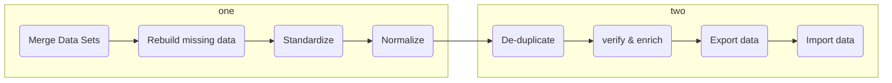

# Section 4 Datawarehouse with Azure Synapse Analytics

这一section,主要介绍Azure synapse service, 主要的reference来源于Udemy paid course和[youtube resource by wafastudies](https://www.youtube.com/watch?v=Qoatg-SPpe4&list=PLMWaZteqtEaIZxPCw_0AO1GsqESq3hZc6)


**Table of contents:**

[toc]

# Azure synapse基本介绍


## Azure Synapse Analytics

Azure Synapse 是最新的一个捆绑service (Platform as a service), 捆绑了以下的服务

- SQL technologies used in data warehousing (Synapse SQL) 吞并了Synpase
- Spark technologies used in Bigdata (Apache Spark)
- Pipelines for data integration and ELT/ETL (ADF)

 之前的服务是这样的


Where ADF is Azure data factory, ADB the Azure databrick

Synpase 也就是把ingestion, integration, ETL和储存服务，都用一个service来包括了, 如下图


说白了，做这个synapse analytics的核心意义是:

- 将多个service合并起来，来简化操作(并没有这么觉得，反而complicate things)
- 增加用户粘性


Adam做的这张示意图更清晰一点:

- Azure Synapse Analytics是一个unifined studio融合了
  - Pipelines (ADF的ETL功能)
  - Spark core (for data transformation)
  - Synapse SQL
    - SQL pools (dedicated)
    - Serverless SQL (ad-hoc)


reddit dataengineering subreddit网友表示:

- still prefer databrick
- synapse seems like a rush job and less polished


### Synapse 架构

Azure Synapse里有两种compute options

- **SQL Pool**
- **Serverless SQL pool**
- Apache spark pool (not covered here)

Azure Synapse的架构如下


### Azure Synapse Analytics

Overview:

- Synapse workspace
- Linked Service
- Synapse SQL
- Apache Spark for synapse
- Pipelines


**Synapse workspace**

- Workspace is a collaboration place for doing cloud-based enterprise analytics in Azure
- A workspace 需要和ADLS一起创建, 1-to-1连接


**Linked Service**

- 连接内/外部数据库的方法,连接后可以直接在workspace里面access


**Synapse SQL**

- Synapse SQL is the ability to do T-SQL based analytics in Synapse workspace
- Synapse SQL has two consumption models: dedicated and serverless
- Synapse SQL Pools actually helps you to run SQL scripts


**Apache Spark for synapse**

- Gives the ability to do Spark based analytics in Synapse Workspace
- Create Apache spark pools才能开始处理
- two ways to use it
  - Notebooks
  - jar

**Pipelines**

- pipelines are how Azure synapse provides data integration (logical group of activities)


## **Lab** External table in serverless SQL Pool

Lab: create an external table in serverless SQL pool

External table concepts

- 在Azure Synapse有一个概念叫做external table, 也就是access data from external database
- 应用场景是，你只想要access某些在别的数据库中的数据，不想要把数据copy over到本地的database中来，可以用这个功能
- The data lies in another source and we just defined the table structure in Azure Synapse
- 需要的步骤很简单:
  - 创建一个database
  - 创建一个Master key
  - 决定你需要连接的权限方式 （SAS for example）
  - 找到你想到的container的link


```sql
DROP DATABASE appdb;

CREATE DATABASE [appdb]

-- Here we are creating a database master key. This key will be used to protect the Shared Access Signature which is specified in the next step
-- Ensure to switch the context to the new database first

CREATE MASTER KEY ENCRYPTION BY PASSWORD = 'P@ssw0rd@123';

-- Here we are using the Shared Access Signature to authorize the use of the Azure Data Lake Storage account

CREATE DATABASE SCOPED CREDENTIAL SasToken
WITH IDENTITY='SHARED ACCESS SIGNATURE'
, SECRET = '?sv=2021-06-08&ss=bfqt&srt=sco&sp=rl&se=2022-11-25T07:07:32Z&st=2022-11-24T23:07:32Z&spr=https&sig=%2BSocArrfRCi39MArj0hbxQeya8dUyAroJhYeQ7dAazo%3D';

-- This defines the source of the data. 

CREATE EXTERNAL DATA SOURCE log_data
WITH (    LOCATION   = 'https://datalake0329.blob.core.windows.net/data',
          CREDENTIAL = SasToken
)
-- https://datalake0329.blob.core.windows.net/data/raw/Log.csv


/* This creates an External File Format object that defines the external data that can be 
present in Hadoop, Azure Blob storage or Azure Data Lake Store

Here with FIRST_ROW, we are saying please skip the first row because this contains header information
*/

CREATE EXTERNAL FILE FORMAT TextFileFormat WITH (  
      FORMAT_TYPE = DELIMITEDTEXT,  
    FORMAT_OPTIONS (  
        FIELD_TERMINATOR = ',',
        FIRST_ROW = 2))

-- Here we define the external table

CREATE EXTERNAL TABLE [logdata]
(
    [Id] [int] NULL,
	[Correlationid] [varchar](200) NULL,
	[Operationname] [varchar](200) NULL,
	[Status] [varchar](100) NULL,
	[Eventcategory] [varchar](100) NULL,
	[Level] [varchar](100) NULL,
	[Time] [datetime] NULL,
	[Subscription] [varchar](200) NULL,
	[Eventinitiatedby] [varchar](1000) NULL,
	[Resourcetype] [varchar](1000) NULL,
	[Resourcegroup] [varchar](1000) NULL)
WITH (
 LOCATION = '/raw/Log.csv',
    DATA_SOURCE = log_data,  
    FILE_FORMAT = TextFileFormat
)

-- If you made a mistake with the table, you can drop the table and recreate it again
DROP EXTERNAL TABLE [logdata]

SELECT * FROM [logdata]

SELECT [Operationname] , COUNT([Operationname]) as [Operation Count]
FROM [logdata]
GROUP BY [Operationname]
ORDER BY [Operation Count]

```


## External Data Source

External data sources are used to establish connectivity with external reousrces such as Azure storage.


  access的顺序为

- Master key

- scoped credential
- External data source
- External file format (csv, parquet)
- External table
- Done! U can now select as you need

```sql

```


## Lab SQL pool

Dedicated SQL pool, 原来叫做Azure SQL Data Warehouse, 变成part of Synapse了. It is measured in **data warehousing units (DWU)**.


Server url 有点问题，报错`Schema of the input URL is not supported. Please revise the following schema and try again.`


## Dedicated SQL pool vs Serverless SQL pool

| -              | serverless pool                                              | SQL pool                                                     |
| -------------- | ------------------------------------------------------------ | ------------------------------------------------------------ |
| Application    | for ad-hoc analysis to create external tables                | for repeated access to the same amount of data               |
| Price          | pay per TB processed                                         | Per DWU provisioned                                          |
|                | Data is stored in relational tables                          | Data is stored in Data Lake                                  |
| Cost reduction | Cost is managed by pasuing SQL pool or scaling down warehouse | Cost is automatically handled and invoiced on a pay-per-query basis |


## Cleansing data

This is the process of finding and correcting/removing corrupt or inaccurate records in a record set.

Common rules are:

- What do you do with rows that have columns with Null values?
- What do you do with records that have duplicate row values?
- Formatting dates, different systems might store dates in different formats

Please see the rich diagram below.




## Loading data into Dedicated SQL Pool

Dedicated SQL pool, 以前叫sql warehouse, 实际上是给OLAP服务的database, 和平时我们insert, update, delete等是在OLTP database做的


# Designing a data warehouse

ERD is for database of OLTP, but for OLAP of data warehouse 首先了解两个概念，Fact Tables和Dimension tables (star schema, snowflake schema)


|          | Fact Tables                                                  | Dimension                                                    |
| -------- | ------------------------------------------------------------ | ------------------------------------------------------------ |
| 简单介绍 | Contains the **measurement of business processes** and it contains FK for the dimension tables. | contains **attributes of the measurements** stored in fact table |
|          |                                                              |                                                              |
|          |                                                              |                                                              |


- Load dimension table first, then fact tables. 
  - 因为fact tables需要定义foreign key，但foreign key需要有dim table的PK才能一一对应，没有dim table, 也就没有dim table PK, 也就不能定义fact tables的FK, 综上所述，需要先定义dim table


这一章会教我们，怎么做一个fact table和dimension table. 


Star schema的具体例子如下，dimtables围绕着fact table, 犹如星星一样, 这就叫做star schema, 这么做的目的是在OLAP warehouse中提高query速度。


## Facts Table and Dimension tables

Facts table储存信息，dimension tables give context to it so we can understand data.


- Fact tables
  - It contains measurements, facts or metrics of the attributes
  - Hold no meaning in itself
  - Numeric and quantifiable
  - Created or loaded after dimensions are loaded
  - Primary Key is a new column identifying the unique row, references dim tables with FK
- Dimension tables:
  - Give context to fact, holds attributes for the facts
  - Created or loaded before facts are loaded
  - Primary key is referenced by fact tables


### Star Schema VS Snowflake Schema

[MS Learn](https://learn.microsoft.com/en-us/azure/synapse-analytics/sql-data-warehouse/sql-data-warehouse-tables-overview)


## **Lab** Dimensional modeling

见lab folder for detail;


## Dedicated SQL pool architecture

有60多种table distribution在dedicated SQL pool (data warehouse(~PB, bulk insert)), 由于数据量和OLTP的数据库(~TB, many inserts and deletes)的管理的数据量不一样和读写规律不一样，自然数据的储存也需要一些优化方式。


>  什么是distributed table? A distributed table appears as a single table, but the rows are actually stored across 60 distributions. The rows are distributed with a **hash** or **round-robin** algorithm.


## Different table types

不同的distribution其实就是different ways to partition data in your data warehouse.


这里介绍三种distribution, example data in datawarehouse如下

| Id   | Course | Category     |
| ---- | ------ | ------------ |
| 1    | DP-203 | Data         |
| 2    | AZ-304 | Architecture |
| 3    | AZ-303 | Architecture |


### Round-robin distributed tables

One row for each compute node, 这样的分配数据方法improves loading speed. 这也同时是default type with the symbol `dbo.dimCustomer`.


> `DBCC PDW_SHOWSPACEUSED('[DBO].[SalesFact]')` 你可以用这条command, 来看table的distribution

在你的dedicated SQL pool中，你run this command will pop up, header row的意义分别是:

| Name            | Description                                                  |
| --------------- | ------------------------------------------------------------ |
| ROWS            |                                                              |
| RESERVED_SPACE  |                                                              |
| DATA_SPACE      |                                                              |
| INDEX_SPACE     |                                                              |
| UNUSED_SPACE    |                                                              |
| PDW_NODE_ID     | 在哪个node里储存，由于我们DWU(data warehouse unit)选的很小，估计就分配给我们一个资源，所以都是1 |
| DISTRIBUTION_ID |                                                              |


```markdown
ROWS RESERVED_SPACE DATA_SAPCE INDEX_SPACE UNUSED_SPACE PDW_NODE_ID DISTRIBUTION_ID
2397	272	176	16	80	1	1
2397	272	176	16	80	1	2
3196	336	224	16	96	1	3
2809	272	200	16	56	1	4
2397	272	176	16	80	1	5
2397	272	176	16	80	1	6
2397	272	176	16	80	1	7
3196	336	224	16	96	1	8
3995	400	280	16	104	1	9
3608	336	256	16	64	1	10
2809	272	200	16	56	1	11
2397	272	176	16	80	1	12
3196	336	224	16	96	1	13
3196	336	224	16	96	1	14
2809	272	200	16	56	1	15
2397	272	176	16	80	1	16
2397	272	176	16	80	1	17
3196	336	224	16	96	1	18
3714	336	256	16	64	1	19
2809	272	200	16	56	1	20
2010	272	152	16	104	1	21
2397	272	176	16	80	1	22
2397	272	176	16	80	1	23
2397	272	176	16	80	1	24
2010	272	152	16	104	1	25
1598	208	120	16	72	1	26
1598	208	120	16	72	1	27
1598	208	120	16	72	1	28
1598	208	120	16	72	1	29
1598	208	120	16	72	1	30
1211	208	96	16	96	1	31
799	144	72	16	56	1	32
799	144	72	16	56	1	33
412	144	48	16	80	1	34
799	144	72	16	56	1	35
799	144	72	16	56	1	36
799	144	72	16	56	1	37
799	144	72	16	56	1	38
799	144	72	16	56	1	39
799	144	72	16	56	1	40
799	144	72	16	56	1	41
1598	208	120	16	72	1	42
1598	208	120	16	72	1	43
1598	208	120	16	72	1	44
1598	208	120	16	72	1	45
1598	208	120	16	72	1	46
1211	208	96	16	96	1	47
1598	208	120	16	72	1	48
1598	208	120	16	72	1	49
1598	208	120	16	72	1	50
1598	208	120	16	72	1	51
2397	272	176	16	80	1	52
2397	272	176	16	80	1	53
2010	272	152	16	104	1	54
1598	208	120	16	72	1	55
1598	208	120	16	72	1	56
1598	208	120	16	72	1	57
2397	272	176	16	80	1	58
3196	336	224	16	96	1	59
2809	272	200	16	56	1	60
```

 接下来你run这个command, 由于SQL是declarative language, 后面的是实际运行的方法;

```sql
-- If you execute the below query
SELECT 
		[CustomerID],
    COUNT([CustomerID]) AS [COUNT] 
FROM 
		[dbo].[SalesFact]
GROUP BY [CustomerID]
ORDER BY [CustomerID]

```


### Hash-distributed data

Choose category column as the `hash value` on each compute node


### Replicated tables

A full copy of the table is cached on each compute node.


# Reference

- [Servless SQL pool VS Dedicated SQL pool](https://www.royalcyber.com/resources/blogs/dedicated-sql-pool-vs-serverless-sql/)
- [snowflake schema vs star schema](https://www.youtube.com/watch?v=Qq4yhhAk9fc)

