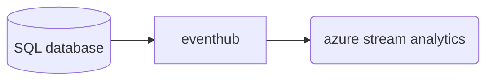

# Section 6 Streaming with event hub


之前的几章讲了batching processing的实现:

- **Data storage**: ADLS gen2
- **Batch processing**: Spark 
- **Analytical Data Store**: Azure Synapse
- **Reporting**: Power BI
- **Orchestration**: Azure Data Factory


但现在需要做real-time processing:

- Real-time message ingestion: (ingestion后可以先存起来或者直接stream processing)
  - Apache Kafka
  - Azure Event hubs
- Data storage:
  - ADLS 2
  - blob
- Stream processing
  - Azure stream Analytics
  - Storm
  - Spark stream (sparkstream处理streaming data 实际上是near-real time 实际上是很小很小的batch processing而不是datagram实时处理, but good)
- Analytical data store
  - Azure Synapse
  - Spark, Hive, HBase
- Reporting
  - PowerBI


## What are Azure Event Hubs

Event hubs:

- a big data streaming platform (PaaS)
- 处理millions of events per second 


几个main components:

- **Event Producer**: producer通过不同的传输协议，传到event hub中
- **Partitions**: 
- **Consumer groups**: 不只是一个人需要access到你的streaming data, 所以是一个Event Receiver
- Throughput
- **Event Receiver**: 在这门课程里, event receiver为Azure Stream Analytics


## Lab: send and receive event hub

c# setup is a pain in the ass.


## What is Azure stream analytics?


## Lab: create a stream analytis job

创造一个stream analytics job

- 定义SU assigned (streaming units)
- 定义常规:
  - Location, research group


- stream analytics job由三部分组成
  - inputs区别是什么?
    - Stream input
      - event hub
      - iot hub
      - azure blob/ADLS 2
    - reference input
  - output
    - 种类太多了
  - Query (stream analytics SQL 一种T-SQL变种)


Lab内容:

- input: event hub 
- output: ADLS
- Storage account settings:  由于output是ADLS, oad进入加一个storage account for staging area
- 创造一个order table


```sql
-- Lab - Azure Stream Analytics - Defining the job

CREATE TABLE [dbo].[Orders]
(
	[OrderID] varchar(10),
	[Quantity] int,
	[UnitPrice] decimal(5,2),
	[DiscountCategory] varchar(10)
)


SELECT
    OrderID,Quantity,UnitPrice,DiscountCategory
INTO
    [Orders] -- 这里定义输出，输出到table order中
FROM
    [apphub] -- 这里定义输入, eventhub取名为apphub
```


## Lab: Reading diagnostics data 





## Lab: read json


只需要换input为adls gen2就可以了


```sql
-- Lab - Reading data from a JSON file - Implementation

-- This is staging table
CREATE TABLE [dbo].[dblog]
(
	[count] [bigint],
	[total] [bigint],
	[minimum] [bigint],
	[maximum] [bigint],
	[resourceId] [varchar](1000),
	[time] datetime,
	[metricName] [varchar](500),
	[timeGrain] [varchar](100),
	[average] [bigint]
)
WITH
(
	DISTRIBUTION = ROUND_ROBIN,
	HEAP
)


SELECT
    [count],
    [total],
    [minimum],
    [maximum],
    [resourceId],
    [time],
    [metricName],
    [timeGrain],
    [average]
INTO
    dblog
FROM
    datalake0329 -- name of my data lake name
```


## Lab: actual streaming eventhub with json


lab background:

streaming complex and nested json 的时候,如,

```json
[
  {
    "records":[
      {
        count: "adam",
        total: 3
      },
      {
        name: "halo",
        age: 4
      },
      {
        name: "li",
        age: 5
      }
    ]
  }
]
```

 你定义stream analytics 的query 如

```sql
SELECT
    [count],
    [total],
    [minimum],
    [maximum],
    [resourceId],
    [time],
    [metricName],
    [timeGrain],
    [average]
INTO
    dblog
FROM
    datalake0329 -- name of my data lake name
```

不会work, 因为会你需要改你的query, 来parse multiline json

```sql
-- Lab - Reading data from the Event Hub - Implementation (read multi line json)

-- Reference
-- https://docs.microsoft.com/en-us/stream-analytics-query/getarrayelements-azure-stream-analytics

SELECT
    Records.ArrayValue.count as [count],
    Records.ArrayValue.total as [total],
    Records.ArrayValue.minimum as [minimum],
    Records.ArrayValue.minimum as [maximum],
    Records.ArrayValue.resourceId as [resourceId],
    CAST(Records.ArrayValue.time AS datetime) as [time],
    Records.ArrayValue.metricName as [metricName],
    Records.ArrayValue.timeGrain as [timeGrain],
    Records.ArrayValue.average as [average]
INTO
    dblog -- output to a table in synapse
FROM
    dbhub d
    CROSS APPLY GetArrayElements(d.records) AS Records -- 先获得第一个[]中的数据
```


## Lab: window functions

略


